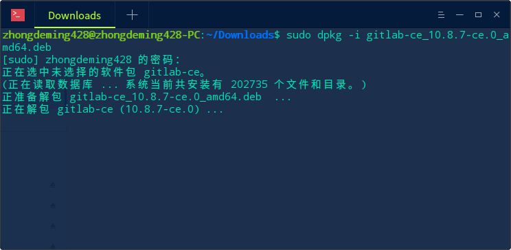
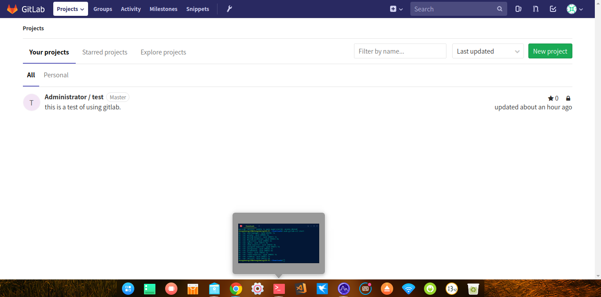

# 在 Deepin 中搭建 GitLab

入职半个月了，一直在接受业务知识以及企业文化知识的培训，下周终于要开始上岗入手项目了。由于公司使用自己搭建的 GitLab 服务作为项目版本控制器，所以我决定学习一下 GitLab，由于这货跟 GitHub 都是基于 Git，所以代码管理方面没有啥区别，主要学习的是 GitLab 服务的搭建。

## 一、安装步骤

输入一下命令更新源，然后安装依赖 `openssh-server` 和 `ca-certificates`。

    sudo apt-get update
    sudo apt-get install -y openssh-server ca-certificates

如果需要邮箱提醒服务，还需要安装 `postfix`，当然你也可以安装其他邮件服务。

安装方法：

    sudo apt-get install -y postfix

如果没有配置过 postfix，那么安装过程中会跳出来配置选项。依次选择“Internet Site” => “确定” => 填入服务器域名 => “确定”。

安装 GitLab 包。

[官网教程](https://about.gitlab.com/installation/#ubuntu)上面写的是使用 curl 下载一个 Shell 脚本，然后通过这个脚本安装 GitLab，但是实际上访问的时候，会提示 404 不存在的错误，所以此路不通。实际上访问 [GitLab 官网](https://about.gitlab.com/downloads/)的下载页面的时候，也是 404 不存在，不知道为什么官方人员还没有发现这个问题。

这里我使用的是手动安装，先去 GitLab 的 [GitLab 仓库](https://packages.gitlab.com/gitlab/gitlab-ce/)下载 deb 包（因为 Deepin 属于 Debian 系），然后通过 `dpkg` 命令进行安装。

这里最好选择社区版（gitlab-ce）。

下载之后可以有两种方法进行安装：

*   1.命令行安装

        sudo dpkg -i gitlab-ce_xx.x.x-ce.x_amd64.deb
    
    效果如图：
    

*   2.右键 deb 包，然后在”打开方式“中选择“深度软件包管理器”就可以了，然后就可以开始安装。

安装之后开始配置 GitLab，使用 gedit 或者 vim 打开 `/etc/gitlab/gitlab.rb`。然后修改 `external_url` 的值为你的本机ip，比如“127.0.0.1”。

然后重新配置 GitLab：

    sudo gitlab-ctl reconfigure

配置完成后通过下面命令查看 GitLab 的服务状况：

    sudo gitlab-ctl status

如果结果如下，则代表开启成功：

    ok: run: alertmanager: (pid 9288) 1s
    ok: run: gitaly: (pid 9297) 0s
    ok: run: gitlab-monitor: (pid 9311) 0s
    ok: run: gitlab-workhorse: (pid 9314) 1s
    ok: run: logrotate: (pid 9331) 0s
    ok: run: nginx: (pid 9337) 0s
    ok: run: node-exporter: (pid 9347) 0s
    ok: run: postgres-exporter: (pid 9349) 1s
    ok: run: postgresql: (pid 9362) 0s
    ok: run: prometheus: (pid 9364) 0s
    ok: run: redis: (pid 9403) 0s
    ok: run: redis-exporter: (pid 9444) 0s
    ok: run: sidekiq: (pid 9460) 0s
    ok: run: unicorn: (pid 9467) 1s

如果结果如下，则代表开启失败，还需要做处理（后文会讲到）：

    fail: alertmanager: runsv not running
    fail: gitaly: runsv not running
    fail: gitlab-monitor: runsv not running
    fail: gitlab-workhorse: runsv not running
    fail: logrotate: runsv not running
    fail: nginx: runsv not running
    fail: node-exporter: runsv not running
    fail: postgres-exporter: runsv not running
    fail: postgresql: runsv not running
    fail: prometheus: runsv not running
    fail: redis: runsv not running
    fail: redis-exporter: runsv not running
    fail: sidekiq: runsv not running
    fail: unicorn: runsv not running

如果成功开启了 GitLab 服务，接下来就可以打开你的浏览器，输入“127.0.0.1”或者你在局域网中的 ip 进入 GitLab 的服务界面了。局域网内的其它机器也可以通过你的局域网 IP 访问你机器上的 GitLab 服务，这样就形成了一个私有的 Git 版本管理。

成功后的服务界面：

## 二、常见问题

### （1）服务开启失败

错误结果显示如下：

    fail: alertmanager: runsv not running
    fail: gitaly: runsv not running
    fail: gitlab-monitor: runsv not running
    fail: gitlab-workhorse: runsv not running
    fail: logrotate: runsv not running
    fail: nginx: runsv not running
    fail: node-exporter: runsv not running
    fail: postgres-exporter: runsv not running
    fail: postgresql: runsv not running
    fail: prometheus: runsv not running
    fail: redis: runsv not running
    fail: redis-exporter: runsv not running
    fail: sidekiq: runsv not running
    fail: unicorn: runsv not running

这说明　runsv 服务未开启，通过一下命令开启即可：

    systemctl start gitlab-runsvdir.service

    systemctl status gitlab-runsvdir.service

    sudo gitlab-ctl start

### （２）打开页面时显示 502 错误

界面提示“Whoops, GitLab is taking too much time to respond.”，这说明 GitLab 此时占用了过多的内存资源。你需要对服务器进行扩容，或者清理掉一些不需要的且占内存的服务。

### （３）GitLab 占用内存过高

这个问题基本没有啥办法，只能是扩展内存了，因为开启服务确确实实需要占据大量内存。