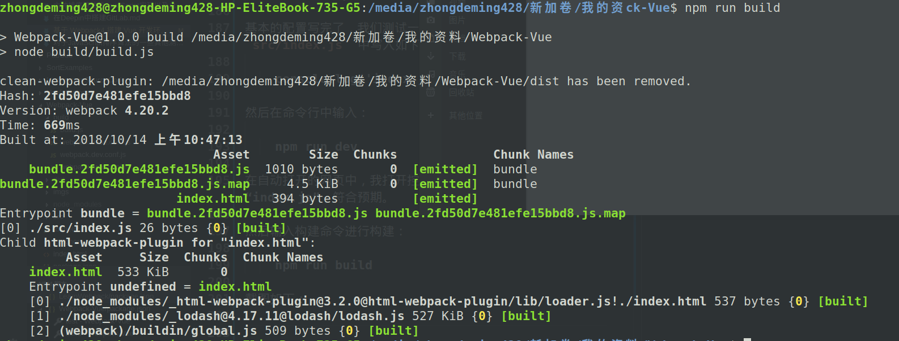

自从工作之后，就已经很久没有写过博客了。时间被分割得比较碎，积累了一段时间的学习成果，才写下了这篇博客。

之前有写过 Webpack4 的文章，但是都比较偏入门，唯一的一篇实战篇 —— [基于Webpack搭建React开发环境](https://juejin.im/post/5afc29fa6fb9a07ab379a2ae)，也是比较简单的，没有涉及到 CSS 抽取，第三方库打包等功能，这篇文章相对而言比较深入。但由于作者水平有限，难免存在谬误之处，欢迎大家指正。

还有没入门的童鞋可以参考我之前的文章：

  * [浅入浅出webpack](https://juejin.im/post/5afa9cd0f265da0b981b9af9)
  * [基于Webpack搭建React开发环境](https://juejin.im/post/5afc29fa6fb9a07ab379a2ae)

## 一、初始化项目

在命令行中敲入如下命令：

    mkdir Webpack-Vue && cd Webpack-Vue && npm init -y
  
然后你就可以在你的当前路径下看到一个叫 `Webpack-Vue` 的文件夹，里面有一个包含默认信息的 `package.json` 文件，打开并修改这个文件的一些内容。

然后我们在项目文件夹中创建以下几个文件夹：

  * dist
  * src、src/components
  * build

Linux 下可以输入一下命令进行快速创建：

    mkdir src src/components dist build -p

其中，dist 用于存放 Webpack 打包后的项目文件、src 用于存放你的源代码文件、build 用于存放 Webpack 打包相关的配置文件。

在 src 下，创建入口文件 `index.js`。

Linux 下创建的命令：

    touch ./src/index.js

在根目录下创建 `index.html` 文件，内容如下：

    <!DOCTYPE html>
    <html>
      <head>
        <title>Webpack Vue Demo</title>
        <meta http-equiv="Content-Type" content="text/html;charset=UTF-8">
        <meta name="viewport" content="width=device-width, initial-scale=1.0">
      </head>
      <body>
        

      </body>
    </html>

这将用于作为我们应用的模板，打包的 js 文件会在 Webpack 插件的处理下插入到这个文件中。

其他配置性文件根据你自己的喜好来添加了，比如 `.gitignore` 文件等。

## 二、安装 Webpack

要使用 `Webpack`，第一步当然是先安装。使用以下命令进行安装：

    npm i webpack webpack-cli -D

然后你就可以看到你的项目文件夹中多了一个 `node_modules` 文件夹，然后 `package.json` 文件中多了一个 `devDependencies` 属性。里面包含了安装的依赖名称和依赖版本，现在暂时还只有 `webpack` 和 `webpack-cli`。

## 三、配置最基本的 Webpack

这一节我们将着手配置一个具有最基本打包功能的项目，从 `src/index.js` 开始对项目进行打包。

为了项目结构更加科学合理，我们把所有的 Webpack 配置相关的文件都存放在了 `build` 目录中。

进入 `build` 文件夹，然后创建以下几个文件：

  * webpack.base.conf.js
  * webpack.dev.conf.js
  * webpack.prod.conf.js
  * build.js

在 Linux 中，可以敲入如下命令快速创建：

    cd build/ && touch webpack.base.conf.js webpack.dev.conf.js webpack.prod.conf.js build.js

其中，`webpack.base.conf.js` 是最基础的打包配置，是开发环境和生产环境都要用到的配置。`webpack.dev.conf.js` 就是在开发环境要使用的配置。`webpack.prod.conf.js` 就是在生产环境要使用的配置了。`build.js` 是通过 Node 接口进行打包的脚本。

接下来我们在对应的文件中写入最基本的配置信息。

### （1） webpack.base.conf.js

先写最基本的配置信息：

    const path = require('path');
    const HtmlWebpackPlugin = require('html-webpack-plugin');
    module.exports = {
      entry: {
        bundle: path.resolve(__dirname, '../src/index.js')
      },
      output: {
        path: path.resolve(__dirname, '../dist'),
        filename: '[name].[hash].js'
      },
      module: {
        rules: [
          
        ]
      },
      plugins: [
        new HtmlWebpackPlugin({
          template: path.resolve(__dirname, '../index.html')
        })
      ]
    };

### （2） webpack.dev.conf.js

同样写入最基本的配置信息：

    const merge = require('webpack-merge');
    const path = require('path');
    const baseConfig = require('./webpack.base.conf');
    module.exports = merge(baseConfig, {
      mode: 'development',
      devtool: 'inline-source-map',
      devServer: {
        contentBase: path.resolve(__dirname, '../dist'),
        open: true
      }
    });

### （3） webpack.prod.conf.js

继续写入最基础的配置：

    const merge = require('webpack-merge');
    const CleanWebpackPlugin = require('clean-webpack-plugin');
    const path = require('path');
    const baseConfig = require('./webpack.base.conf');
    module.exports = merge(baseConfig, {
      mode: 'production',
      devtool: 'source-map',
      module: {
        rules: []
      },
      plugins: [
        new CleanWebpackPlugin(['dist/'], {
          root: path.resolve(__dirname, '../'),
          verbose: true,
          dry: false
        })
      ]
    });

注意到我们上面引用了两个新的依赖，需要先进行安装才能使用：

    cnpm i webpack-merge clean-webpack-plugin webpack-dev-server html-webpack-plugin -D

### (4) build.js

这个脚本用于构建生产环境，开发环境基于 `webpack-dev-server` 搭建，不写脚本。

接下来，写入我们的打包脚本，通过 Node 调用 Webpack 进行打包。

    const webpack = require('webpack');
    const config = require('./webpack.prod.conf');

    webpack(config, (err, stats) => {
      if (err || stats.hasErrors()) {
        // 在这里处理错误
        console.error(err);
        return;
      }
      // 处理完成
      console.log(stats.toString({
        chunks: false,  // 使构建过程更静默无输出
        colors: true    // 在控制台展示颜色
      }));
    });

这样做的好处是可以利用 Node 做一些其他的事情，另外当 Webpack 配置文件不在项目文件夹根部时方便调用。

### （5） npm scripts

配置 npm scripts 能够使我们更方便的使用打包命令。

在 `package.json` 文件的 `scripts` 属性中，写入如下两条：

    "build": "node build/build.js",
    "dev": "webpack-dev-server --inline --progress --config build/webpack.dev.conf.js"

基本的配置写完了，我们测试一下打包效果，在 `src/index.js` 中写入如下代码：

    console.log('index.js!');

然后在命令行中输入：

    npm run dev

在自动打开的网页中，我打开控制台，我们可以看到输出了一句“index.js”，符合预期。

然后输入构建命令进行构建：

    npm run build

截图如下：

这就表示打包成功了，但是我们还只完成了最基本的打包功能，Vue 还不能使用，接下来我们将这个项目变得更加强大。

## 四、引入一些基础的 Loader

为了方便开发，我们需要引入一些 Loader，以简化我们的写法以及使我们的代码兼容更多的环境。

这一部分可以根据 Webpack 的文档来写，因为都是一些基本的东西，配置起来也不难。

### （1）babel-loader

为了使我们的 JavaScript 代码兼容更多环境，我们需要使用 babel-loader。

**配置方法：**

首先安装 `babel-loader`、`babel-preset-env` 和 `babel-core`。需要注意的是，如果你的 `babel-loader` 是 7.x 版本的话，你的 `babel-core` 必须是 6.x 版本；如果你的 `babel-loader` 是 8.x 版本的话，你的 `babel-core` 必须是 7.x 版本。如果不这样的话，Webpack 会报错。

安装命令如下：

    npm i babel-loader@7 babel-core babel-preset-env -D

然后在 `webpack.base.conf.js` 的 `module.rules` 中新增如下对象：

    {
      test: /\.js$/,
      use: 'babel-loader',
      exclude: /node_modules/
    }

我们还需要添加一个配置文件（.babelrc）在根目录下：

    {
      "presets": [
        ["env", {
          "modules": false,
          "targets": {
            "browsers": ["> 1%", "last 2 versions", "not ie <= 8"]
          }
        }]
      ]
    }

这就是 babel-preset-env 的作用，帮助我们配置 babel。我们只需要告诉它我们要兼容的情况（目标运行环境），它就会自动把代码转换为兼容对应环境的代码。

 以上代码表示我们要求代码兼容最新两个版本的浏览器，不用兼容 IE 8，另外市场份额超过 1% 的浏览器也必须支持。

 只需要告诉 babel-preset-env 你想要兼容的环境，它就会自动转换，是不是很爽？再也不用配置那么多了。

 接下来我们试一试，把 `src/index.js` 中的代码改写为：

    const x = 'index.js';

    const y = (x) => {
      console.log(x);
    }

    y(x);

然后使用 `npm run build` 进行打包，打包之后的代码中：

    var x = 'index.js';

    var y = function y(x) {
      console.log(x);
    };

    y(x);

说明我们的代码已经被成功地转换了。

为了做一个对比，未配置 `babel` 时，转换结果如下：

    const x = 'index.js';

    const y = (x) => {
      console.log(x);
    }

    y(x);

### （2）file-loader

这个用于将字体文件、图片文件进行模块化。

首先安装 `file-loader`：

    npm i file-loader -D

然后在 `webpack.base.conf.js` 中添加如下配置到 `module.rules`：

    {
      test: /\.(png|svg|jpg|gif)$/,
      use: [
        'file-loader'
      ]
    },
    {
      test: /\.(woff|woff2|eot|ttf|otf)$/,
      use: [
        'file-loader'
      ]
    }

当然可以简化配置信息，把两个 test 正则合并到一处。

接下来我们配置 `vue-loader`。

### （3） vue-loader

为了使用 Vue 单文件组件，我们需要对 `.vue` 文件进行处理，使用 `vue-loader`。

首先安装 `vue-loader`、`css-loader`、`vue-style-loader` 和 `vue-template-compiler`，后者也是必不可少的，少了会报错。

命令：

    npm i vue-loader css-loader vue-style-loader vue-template-compiler -D

然后我们配置 `webpack.base.conf.js`，写入以下代码到该文件的 `module.rules` 属性当中：

    {
      test: /\.vue$/,
      loader: 'vue-loader'
    },
    {
      test: /\.css$/,
      use: ['vue-style-loader', 'css-loader']
    }

只有这一处配置是不行的，根据 [vue-loader 官网](https://vue-loader.vuejs.org/zh/guide/)的说明，我们还需要配置一个插件，然后还需要配置 `resolve.alias` 别名，不然 Webpack 没法找到 Vue 模块。

配置插件，首先在文件头部引入：

    const VueLoaderPlugin = require('vue-loader/lib/plugin');

然后在 `plugins` 数组中添加这个插件对象：

    new VueLoaderPlugin(),

随后我们还要配置别名，将 `resolve.alias` 配置为如下对象：

    {
      'vue$': 'vue/dist/vue.esm.js',
      '@': path.resolve(__dirname, '../src'),
    }

这可以使得 Webpack 很方便的找到 Vue，我们在 JavaScript 文件中引入依赖的时候，也可以方便地使用 `@` 来代替 `src`，省去了写文件路径的麻烦。

我们顺便添加一个 `resolve.extensions` 属性，方便我们引入依赖或者文件的时候可以省略后缀：

    extensions: ['*', '.js', '.json', '.vue'],

extensions 属性是一个数组。这样配置之后，我们在 JavaScript 文件中 import JavaScript 文件、json 文件和 Vue 单文件组件都可以省略后缀。

以上几步都很重要，最好不要省略。

接下来我们验证一下 Vue 单文件组件是否可用。

安装 Vue：

    npm i vue --save

然后修改 `index.js` 文件内容如下：

    import Vue from 'vue';
    import App from './App';

    new Vue({
      el: '#app',
      template: '<App/>',
      components: { App }
    });

然后在同级目录下创建一个 `App.vue` 文件，内容如下：

    <template>
      <h1>Hello World!</h1>
    </template>

    

    

运行命令 `npm run dev` 就可以看到一个大大的一级标题 —— Hello World 啦！

到这里，我们的项目已经可以使用 Vue 单文件组件进行开发了，但是还没有完，我们还有一些任务要做。

## 五、优化 CSS 代码

这里我们使用 postcss 的 autoprefixer 插件为我们的 css 代码自动添加前缀以适应不同的浏览器。

首先安装依赖：

    npm i postcss-loader autoprefixer -D

然后修改 `module.rules` 中的 css 配置项，修改之后如下:

    {
      test: /\.css$/,
      use: ['vue-style-loader', 'css-loader', 'postcss-loader']
    }

然后在我们项目的根目录下新增配置文件 `postcss.config.js`，内容如下：

    module.exports = {
      plugins: [
        require('autoprefixer')
      ]
    }

代表我们将要使用 autoprefixer 插件。

之后我们就可以愉快地写代码了，可以自己验证一下是否自动添加了前缀，这里不再赘述。

## 六、开启热更新

Webpack 4 开启热更新相对容易，具体步骤如下：

修改 `webpack.dev.conf.js`，在 `devServer` 属性中设置 `hot` 的值为 `true`，这就代表开启了热更新。但是只这样做还不够，需要我们添加一个插件，继续修改 `webpack.dev.conf.js`。

设置其 plugins 属性如下：

    const webpack = require('webpack');
    // 在文件头部引入 webpack 依赖
    [
      new webpack.HotModuleReplacementPlugin()
    ]

这就开启了 css 热更新（因为 vue-style-loader 封装了 style-loader，热更新开箱即用）,但是 JavaScript 热更新还不能用，每次修改代码我们都会刷新浏览器，所以我们需要继续配置。

为了使得 JavaScript 模块也能进行 HMR，我们需要在我们的 **入口文件（index.js）** 的底部添加如下代码：

    if (module.hot) {
      module.hot.accept();
    }

接下来就可以进行 HMR 了。

## 七、第三方库单独打包

每次我们对项目进行打包时，我们都会把引用的第三方依赖给打包一遍，比如 Vue、Vue-Router、React 等等。但是这些库的代码基本都是不会变动的，我们没必要每次打包都构建一次，所以我们最好将这些第三方库提取出来单独打包，这样有利于减少打包时间。

官方插件是 DllPlugin，但是这个插件配置比较繁琐。网上有人推荐一个比较好用的插件 —— `autodll-webpack-plugin`，确实很好用。

下面是它的配置方法：

首先安装：

    npm i autodll-webpack-plugin -D

然后在 `webpack.base.conf.js` 中引入：

    const AutoDllPlugin = require('autodll-webpack-plugin');

然后在 plugins 属性中添加这个插件：

    new AutoDllPlugin({
      inject: true, // will inject the DLL bundle to index.html
      debug: true,
      filename: '[name]_[hash].js',
      path: './dll',
      entry: {
        vendor: ['vue', 'vue-router', 'vuex']
      }
    })

`inject` 为 true，插件会自动把打包出来的第三方库文件插入到 HTML。`filename` 是打包后文件的名称。`path` 是打包后的路径。`entry` 是入口，`vendor` 是你指定的名称，数组内容就是要打包的第三方库的名称，不要写全路径，Webpack 会自动去 `node_modules` 中找到的。

每次打包，这个插件都会检查注册在 entry 中的第三方库是否发生了变化，如果没有变化，插件就会使用缓存中的打包文件，减少了打包的时间，这时 Hash 也不会变化。

## 八、提取共同代码：

使用 splitChucksPlugin 插件，这是 Webpack 自带的，不用安装第三方依赖。

使用方法：

在 `webpack.base.conf.js` 的 plugins 属性中添加如下插件对象;

    new webpack.optimize.SplitChunksPlugin()

这代表你将使用默认的提取配置来提取你的公共代码，如果你不想使用默认配置，请给插件构造函数传入配置对象.

具体怎么配置，请参考冷星大神的博客 —— [webpack4——SplitChunksPlugin使用指南](https://lengxing.club/2018/09/18/2018-09-18/)，里面关于配置项的作用介绍得很清楚很详细。

## 九、使用 stylus 预处理器

我个人比较喜欢 stylus，因为写起来比较无拘无束，类似 Python，没那么多条条框框，而且用起来也不是很复杂。

引入方法：

首先下载 stylus 和 stylus-loader 依赖：

    npm i stylus stylus-loader -D

然后在配置项 `module.rules` 中添加一个处理 stylus 文件的配置对象。

配置信息如下：

    {
      test: /\.styl(us)$/,
      use: ['vue-style-loader', 'css-loader, 'stylus-loader', 'postcss-loader']
    }

接下来只要你在 Vue 单文件组件的 style 标签加上 `lang='stylus'`，你就可以使用 stylus 来写 CSS 了。

## 十、抽取 CSS 到单文件

这个功能的配置方法在 [Vue Loader 官网](https://vue-loader.vuejs.org/zh/guide/extract-css.html)交代得很清楚了。

使用的是 `mini-css-extract-plugin` 插件，首先安装：

    npm i mini-css-extract-plugin -D

然后在配置文件头部引入：

    const MiniCssExtractPlugin = require('mini-css-extract-plugin')

然后当你要抽取 CSS 的时候（比如生产环境打包），你就把原来配置文件中的所有 `vue-style-loader` 替换为 MiniCssExtractPlugin.loader，其他的什么 `css-loader`、`stylus-loader` 等等都不要动。

最后，修改 plugins 选项，插入如下插件：

    new MiniCssExtractPlugin({
      filename: "[name].css",
      chunkFilename: "[id].css"
    })

打包之后，你会发现所有的 CSS 代码都被抽取到了一个单独的 CSS 文件当中。

## 收获

* 配置要谨慎，一个错误就可能导致莫名其妙的报错。
* 学习 Webpack 要多实践，光理论学起来比较抽象。
* 多查 Webpack 文档，其实很多问题里面都交代清楚了，不要急于到网上找答案。
* 现成的脚手架是最好的范例，比如 Vue-Cli，create-react-app。多看看它们是怎么配置的，可以学到一些东西。

示例代码放在我的 [GitHub 仓库](https://github.com/zhongdeming428/MyMemorandum/tree/master/Webpack-Vue)，需要的同学可以自取。

如有错误，敬请指出！