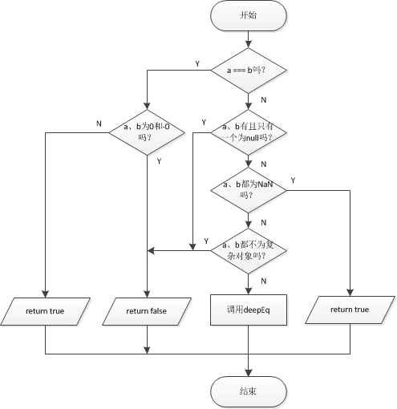

# 如何判断JavaScript中的两变量是否相等？

## 1 为什么要判断？

可能有些同学看到这个标题就会产生疑惑，为什么我们要判断JavaScript中的两个变量是否相等，JavaScript不是已经提供了双等号“==”以及三等号“===”给我们使用了吗？

其实，JavaScript虽然给我们提供了相等运算符，但是还是存在一些缺陷，这些缺陷不符合我们的思维习惯，有可能在使用的时候得到一些意外的结果。为了避免这种情况的出现，我们需要自己函数来实现JavaScript变量之间的对比。

## 2 JavaScript等号运算符存在哪些缺陷？

### 2.1 0与-0

在JavaScript中：

    0 === 0
    //true
    +0 === -0
    //true

相等运算符认为+0和-0是相等的，但是我们应当认为两者是不等的，具体原因源码中给出了一个链接：[Harmony egal proposal](http://wiki.ecmascript.org/doku.php?id=harmony:egal).

### 2.2 null和undefined

在JavaScript中：

    null == undefined
    //true
    null === undefined
    //false

我们应当认为null不等于undefined，所以在比较null和undefined时，应当返回false。

### 2.3 NaN

前文有说过，NaN是一个特殊的值，它是JavaScript中唯一一个自身不等于自身的值。

    NaN == NaN
    //false
    NaN === NaN
    //false    

但是我们在对比两个NaN时，我们应当认为它们是相等的。

### 2.4 数组之间的对比

由于在JavaScript中，数组是一个对象，所以如果两个变量不是引用的同一个数组的话，即使两个数组一模一样也不会返回true。

    var a = [];
    //undefined
    var b = [];
    //undefined
    a=== b
    //false
    a==b
    //false

但是我们应当认为，两个元素位置、顺序以及值相同的数组是相等的。

### 2.5 对象之间的对比

凡是涉及到对象的变量，只要不是引用同一个对象，都会被认为不相等。我们需要做出一些改变，两个完全一致的对象应当被认为是相等的。

    var a  = {};
    //undefined
    var b = {};
    //undefined
    a == b
    //false
    a === b
    //false

这种情况在所有JavaScript内置对象中也适用，比如我们应当认为两个一样的RegExp对象是相等的。

### 2.6 基本数据类型与包装数据类型之间的对比

在JavaScript中，数值2和Number对象2是不严格相等的：

    2 == new Number(2);
    //true
    2 === new Number(2);
    //false

但是我们在对比2和new Number(2)时应当认为两者相等。

## 3 underscore的实现方法

我们实现的方法当然还是依赖于JavaScript相等运算符的，只不过针对特例需要有特定的处理。我们在比较之前，首先应该做的就是处理特殊情况。

underscore的代码中，没有直接将逻辑写在_.isEqual方法中，而是定义了两个私有方法：eq和deepEq。在GitHub用户@[hanzichi](https://github.com/hanzichi/underscore-analysis/blob/master/underscore-1.8.3.js/underscore-1.8.3-analysis.js)的repo中，我们可以看到1.8.3版本的underscore中并没有deepEq方法，为什么后来添加了呢？这是因为underscore的作者把一些特例的处理提取了出来，放到了eq方法中，而更加复杂的对象之间的对比被放到了deepEq中（同时使得deepEq方法更加便于递归调用）。这样的做法使得代码逻辑更加鲜明，方法的功能也更加单一明确，维护代码更加简洁快速。

eq方法的源代码：

    var eq = function (a, b, aStack, bStack) {
		// Identical objects are equal. `0 === -0`, but they aren't identical.
		// See the [Harmony `egal` proposal](http://wiki.ecmascript.org/doku.php?id=harmony:egal).
		//除了0 === -0这个特例之外，其余所有a === b的例子都代表它们相等。
		//应当判断0 !== -0，但是JavaScript中0 === -0。
		//下面这行代码就是为了解决这个问题。
		//当a !== 0或者1/a === 1/b时返回true，一旦a === 0并且1/a !== 1/b就返回false。
		//而a === 0且1/a !== 1/b就代表a，b有一个为0，有一个为-0。
		if (a === b) return a !== 0 || 1 / a === 1 / b;
		//一旦a、b不严格相等，就进入后续检测。
		//a == b成立但是a === b不成立的例子中需要排除null和undefined，其余例子需要后续判断。
		// `null` or `undefined` only equal to itself (strict comparison).
		//一旦a或者b中有一个为null就代表另一个为undefined，这种情况可以直接排除。
		if (a == null || b == null) return false;
		// `NaN`s are equivalent, but non-reflexive.
		//自身不等于自身的情况，一旦a，b都为NaN，则可以返回true。
		if (a !== a) return b !== b;
		// Exhaust primitive checks
		//如果a，b都不为JavaScript对象，那么经过以上监测之后还不严格相等的话就可以直接断定a不等于b。
		var type = typeof a;
		if (type !== 'function' && type !== 'object' && typeof b != 'object') return false;
		//如果a，b是JavaScript对象，还需要做后续深入的判断。
		return deepEq(a, b, aStack, bStack);
	};

对于源码的解读我已经作为注释写在了源码中。
那么根据源码，可以将其逻辑抽象出来：

deepEq的源码：

    var deepEq = function (a, b, aStack, bStack) {
		// Unwrap any wrapped objects.
		//如果a，b是_的一个实例的话，需要先把他们解包出来再进行比较。
		if (a instanceof _) a = a._wrapped;
		if (b instanceof _) b = b._wrapped;
		// Compare `[[Class]]` names.
		//先根据a，b的Class字符串进行比较，如果两个对象的Class字符串都不一样，
		//那么直接可以认为两者不相等。
		var className = toString.call(a);
		if (className !== toString.call(b)) return false;
		//如果两者的Class字符串相等，再进一步进行比较。
		//优先检测内置对象之间的比较，非内置对象再往后检测。
		switch (className) {
			// Strings, numbers, regular expressions, dates, and booleans are compared by value.
			//如果a，b为正则表达式，那么转化为字符串判断是否相等即可。
			case '[object RegExp]':
			// RegExps are coerced to strings for comparison (Note: '' + /a/i === '/a/i')
			case '[object String]':
				// Primitives and their corresponding object wrappers are equivalent; thus, `"5"` is
				// equivalent to `new String("5")`.
				//如果a， b是字符串对象，那么转化为字符串进行比较。因为一下两个变量：
				//var x = new String('12');
				//var y = new String('12');
				//x === y是false，x === y也是false，但是我们应该认为x与y是相等的。
				//所以我们需要将其转化为字符串进行比较。
				return '' + a === '' + b;
			case '[object Number]':
				//数字对象转化为数字进行比较，并且要考虑new Number(NaN) === new Number(NaN)应该要成立的情况。
				// `NaN`s are equivalent, but non-reflexive.
				// Object(NaN) is equivalent to NaN.
				if (+a !== +a) return +b !== +b;
				// An `egal` comparison is performed for other numeric values.
				//排除0 === -0 的情况。
				return +a === 0 ? 1 / +a === 1 / b : +a === +b;
			case '[object Date]':
			//Date类型以及Boolean类型都可以转换为number类型进行比较。
			//在变量前加一个加号“+”，可以强制转换为数值型。
			//在Date型变量前加一个加号“+”可以将Date转化为毫秒形式；Boolean类型同上（转换为0或者1）。
			case '[object Boolean]':
				// Coerce dates and booleans to numeric primitive values. Dates are compared by their
				// millisecond representations. Note that invalid dates with millisecond representations
				// of `NaN` are not equivalent.
				return +a === +b;
			case '[object Symbol]':
				return SymbolProto.valueOf.call(a) === SymbolProto.valueOf.call(b);
		}

		var areArrays = className === '[object Array]';
		//如果不是数组对象。
		if (!areArrays) {
			if (typeof a != 'object' || typeof b != 'object') return false;

			// Objects with different constructors are not equivalent, but `Object`s or `Array`s
			// from different frames are.
			//比较两个非数组对象的构造函数。
			var aCtor = a.constructor, bCtor = b.constructor;
			if (aCtor !== bCtor && !(_.isFunction(aCtor) && aCtor instanceof aCtor &&
				_.isFunction(bCtor) && bCtor instanceof bCtor)
				&& ('constructor' in a && 'constructor' in b)) {
				return false;
			}
		}
		// Assume equality for cyclic structures. The algorithm for detecting cyclic
		// structures is adapted from ES 5.1 section 15.12.3, abstract operation `JO`.

		// Initializing stack of traversed objects.
		// It's done here since we only need them for objects and arrays comparison.
		//初次调用eq函数时，aStack以及bStack均未被传递，在循环递归的时候，会被传递进来。
		//aStack和bStack存在的意义在于循环引用对象之间的比较。
		aStack = aStack || [];
		bStack = bStack || [];
		var length = aStack.length;
		
		while (length--) {
			// Linear search. Performance is inversely proportional to the number of
			// unique nested structures.
			if (aStack[length] === a) return bStack[length] === b;
		}

		// Add the first object to the stack of traversed objects.
		//初次调用eq函数时，就把两个参数放入到参数堆栈中去，保存起来方便递归调用时使用。
		aStack.push(a);
		bStack.push(b);

		// Recursively compare objects and arrays.
		//如果是数组对象。
		if (areArrays) {
			// Compare array lengths to determine if a deep comparison is necessary.
			length = a.length;
			//长度不等，直接返回false认定为数组不相等。
			if (length !== b.length) return false;
			// Deep compare the contents, ignoring non-numeric properties.
			while (length--) {
				//递归调用。
				if (!eq(a[length], b[length], aStack, bStack)) return false;
			}
		} else {
			// Deep compare objects.
			//对比纯对象。
			var keys = _.keys(a), key;
			length = keys.length;
			// Ensure that both objects contain the same number of properties before comparing deep equality.
			//对比属性数量，如果数量不等，直接返回false。
			if (_.keys(b).length !== length) return false;
			while (length--) {
				// Deep compare each member
				key = keys[length];
				if (!(_.has(b, key) && eq(a[key], b[key], aStack, bStack))) return false;
			}
		}
		// Remove the first object from the stack of traversed objects.
		//循环递归结束，把a，b堆栈中的元素推出。
		aStack.pop();
		bStack.pop();
		return true;
	};

对于源码的解读我已经作为注释写在了源码中。
那么根据源码，可以将其逻辑抽象出来：

* 1 使用Object.prototype.toString方法获取两参数类型，如果两参数的原始数据类型都不同，那么可以认为两个参数不相等。
* 2 如果进入了第二步，那么说明两个参数的原始类型相同。针对获取到的字符串进行分类，如果是除Object和Array之外的类型，进行处理。
    
    * RegExp以及String对象转化为字符串进行比较。
    * Number类型的话，需要先使用+运算符强制转化为基本数据类型中的数值型，然后处理特例。比如NaN === NaN，0 !== -0.
    * Date以及Boolean对象转化为数字类型进行对比。（+运算符强制转换，Date转化为13位的毫秒形式，Boolean转化为0或1）
    * Symbol类型使用Symbol.prototype.valueOf获取字符串，然后进行对比（即认为传递给Symbol函数相同字符串所获取到的Symbol对象应该相等）。
* 3 经过以上比较，所剩类型基本只剩Array和基本对象了。如果不是数组对象，那么构造函数不同的对象可以被认为是不相等的对象。
* 4 初始化对象栈aStack以及bStack，因为初次调用deepEq函数时不会传递这两个参数，所以需要手动初始化。因为之后比较的数组对象以及基本对象需要用到对象栈，所以现在应该把当前的a，b推入到两个栈中。
* 5 针对数组，先比较长度，长度不等则数组不等。长度相等再递归调用deepGet比较数组的每一项，有一项不等则返回false。
* 6 基本对象类型比较，先使用_.keys获取对象的所有键。键数量不同的两对象不同，如果键数目相等，再递归调用deepEq比较每一个键的属性，有一个键值不等则返回false。
* 7 经过所有检测如果都没有返回false的话，可以认为两参数相等，返回true。在返回之前会把栈中的数据推出一个。

## 4 underscore的精髓

### 4.1 将RegExp对象和String对象用相同方法处理

有同学可能会疑惑：`/[a-z]/gi`与`/[a-z]ig/`在意义上是一样的，但是转化为字符串之后比较会不会是不相等的？

这是一个非常好的问题，同时也是underscore处理的巧妙之所在。在JavaScript中，RegExp对象重写了toString方法，所以在强制将RegExp对象转化为字符串时，flags会按规定顺序排列，所以将之前两个RegExp对象转化为字符串，都会得到`/[a-z]/gi`。这就是underscore可以放心大胆的将RegExp对象转化为字符串处理的原因。

### 4.2 Date对象和Boolean对象使用相同方法处理

underscore选择将Date对象和Boolean对象都转化为数值进行处理，这避免了纷繁复杂的类型转换，简单粗暴。而且作者没有使用强制转换方法进行转换，而是只使用了一个“+”符号，就强制将Date对象和Boolean对象转换成了数值型数据。

### 4.3 使用对象栈保存当前比较对象的上下文

很多童鞋在阅读源码时，可能会很疑惑aStack以及bStack的作用在哪里。aStack和bStack用于保存当前比较对象的上下文，这使得我们在比较某个对象的子属性时，还可以获取到其自身。这样做的好处就在于我们可以比较循环引用的对象。

    var a = {
        name: 'test'
    };
    a['test1'] = a;
    var b = {
        name: 'test'
    };
    b['test1'] = b;
    _.isEqual(a, b);
    //true

underscore使用aStack和bStack作比较的代码：

    aStack = aStack || [];
    bStack = bStack || [];
    var length = aStack.length;
    while (length--) {
        // Linear search. Performance is inversely proportional to the number of
        // unique nested structures.
        if (aStack[length] === a) return bStack[length] === b;
	}

上面的测试代码中，a、b对象的test1属性都引用了它们自身，这样的对象在比较时会消耗不必要的时间，因为只要a和b的test1属性都等于其某个父对象，那么可以认为a和b相等，因为这个被递归的方法返回之后，还要继续比较它们对应的那个父对象，父对象相等，则引用的对象属性必相等，这样的处理方法节省了很多的时间，也提高了underscore的性能。

### 4.4 优先级分明，有的放矢

underscore的处理具有很强的优先级，比如在比较数组对象时，先比较数组的长度，数组长度不相同则数组必定不相等；比如在比较基本对象时，优先比较对象键的数目，键数目不等则对象必定不等；比如在比较两个对象参数之前，优先对比Object.prototype.toString返回的字符串，如果基本类型不同，那么两个对象必定不相等。

这样的主次分明的对比，大大提高了underscore的工作效率。所以说每一个小小的细节，都可以体现出作者的处心积虑。阅读源码，能够使我们学习到太多的东西。

## 5 underscore的缺陷之处

我们可以在其他方法中看到underscore对ES6中新特征的支持，比如`_.is[Type]`方法已经支持检测Map`（_.isMap）`和Set（`_.isSet`）等类型了。但是`_.isEqual`却没有对Set和Map结构的支持。如果我们使用`_.isEqual`比较两个Map或者两个Set，总是会得到true的结果，因为它们可以通过所有的检测。

在underscore的官方GitHub repo上，我看到有同学已经提交了PR添加了`_.isEqual`对Set和Map的支持。

我们可以看一下源码：

    var size = a.size;
    // Ensure that both objects are of the same size before comparing deep equality.
    if (b.size !== size) return false;
    while (size--) {
        // Deep compare the keys of each member, using SameValueZero (isEq) for the keys
        if (!(isEq(a.keys().next().value, b.keys().next().value, aStack, bStack))) return false;
        // If the objects are maps deep compare the values. Value equality does not use SameValueZero.
        if (className === '[object Map]') {
            if (!(eq(a.values().next().value, b.values().next().value, aStack, bStack))) return false;
        }
    }

可以看到其思路如下：

* 1 比较两参数的长度（或者说是键值对数），长度不一者即为不等，返回false。
* 2 如果长度相等，就逐一递归比较它们的每一项，有任意一项不等者就返回false。
* 3 全部通过则可以认为是相等的，返回true。

这段代码有一个很巧妙的地方在于它没有区分到底是Map对象还是Set对象，先直接使用`a.keys().next().value`以及`b.keys().next().value`获取**Set的元素值或者Map的键**。后面再进行类型判断，如果是Map对象的话，再使用`a.values().next().value`以及`b.values().next().value`获取**Map的键值**，Map对象还需要比较其键值是否相等。

个人认为，这段代码也有其局限性，因为Set和Map可以认为是一个数据集，这区别于数组对象。我们可以说[1,2,3]不等于[2,1,3]，因为其相同元素的位置不同；但是我认为new Set([1,2,3])应该认为等于new Set([2,1,3])，因为Set是无序的，它内部的元素具有单一性。
