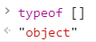
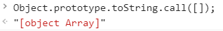

# 鉴定JavaScript中的数据类型
众所周知，JavaScript是一门弱类型的语言，但是这并不代表JavaScript中没有数据类型。JavaScript中常见的数据类型有string、number、object等等，通常我们使用typeof操作符来判断一个变量值的数据类型；但是由于许多问题的存在，往往出现一些出人意料的坑，或者我们无法得到具体的令人满意的答案，所以我们需要自己实现一些函数，用于鉴定各种数据类型，并且得到的结果要符合我们的常识，underscore就实现了一系列这样的函数。

## 1.数组（Array）的鉴定

如果我们使用typeof操作符鉴定一个数组，我们得到的结果将不会是字符串"array"，而是"object"，这使得我们无法精确的判断一个对象是否是数组。

有人觉得使用instanceof操作符可以解决这个问题，因为`[] instanceof Array === true`，但是这个操作符也并不是那么的靠谱。因为instanceof操作符默认假定只有一个全局执行环境，当我们的网页中包含多个框架时，就会有多个全局执行环境，可能会导致'[] instanceof Array'的结果返回false。

JavaScript中实现了一个内置函数Array.isArray用于判断某个对象是否是数组，但是由于Array.isArray兼容性(IE 9+/FireFox 4+/Safari 5+/Opera 10.5+/Chrome)存在问题，所以我们不得不考虑到在低级浏览器中的后备方案。

那么如何实现这个后备方案呢？我们知道在任何值上调用Object原生的toString方法，都会返回一个[object NativeConstructorName]格式的字符串。

那么我们可以通过这种方式来判断。当Array.isArray()可靠时，我们使用这个函数，当其不可靠时，我们使用Object原生的toString方法：

    // Is a given value an array?
    // Delegates to ECMA5's native Array.isArray
    // nativeIsArray = Array.isArray
    // toString = Object.prototype.toString
    _.isArray = nativeIsArray || function(obj) {
        return toString.call(obj) === '[object Array]';
    };

上方代码就是underscore的实现。
在之后的实现方案中，我们可以看到许多类型的鉴定都是通过判断Object.prototype.toString返回的字符串来实现的。

## 2.对象（Object）的鉴定
我们知道在JavaScript中，不只有`var object = {}`或者`var object = new Object()`这种对象，还有许多内置的对象，比如Error、Function、Array、Number、Date、RegExp、Math等等。

通过测试，这些内置对象在使用typeof操作符鉴定其类型时，都会返回“object”，但是有一个例外，就是Function对象：

    typeof new Date()
    //"object"
    typeof new RegExp()
    //"object"
    typeof new Boolean();
    //"object"
    typeof new Array();
    //"object"
    typeof new Object();
    //"object"
    typeof new Error();
    //"object"
    typeof Math
    //"object"
    typeof function(){};
    //"function"

在我们看来，函数理所应当应该是一个对象，因为函数包含许多的属性并且函数具有prototype原型，比如function.length表示函数定义时具有的形参的个数，函数原型中还包含apply、call、bind等常用方法，所以我们应该把函数看做一个对象。

所以我们在判定一个变量值是否是对象时，我们可以通过`typeof variable === "object"`来实现，另外还需要考虑`typeof variable === "function"`时的情况。当然我们不希望我们判断的参数是一个空对象（null或者undefined），所以应当排除这种情况：

    // Is a given variable an object?
    //判断传入的参数是否是一个非空对象。
    _.isObject = function(obj) {
        var type = typeof obj;
        return type === 'function' || type === 'object' && !!obj;
        //!!双感叹号的作用等同于Boolean函数。
        //之所以需要判断!!obj的值，是因为需要确保传入参数是非空对象。
        //!!null===false
    };

以上代码就是underscore中的具体实现。

## 3.内置对象（Function、Date、RegExp等）的鉴定
之前有提到过，使用typeof操作符鉴定内置对象时，除了Function之外都会返回字符串"object"。当我们需要具体鉴定内置对象时，显然typeof操作符不再适合。

因为Array也是内置对象，所以我们可以借鉴之前鉴定Array时所使用的方法——Object.prototype.toString。

我们看underscore是如何实现的：

    // Add some isType methods: isArguments, isFunction, isString, isNumber, isDate, isRegExp, isError, isMap, isWeakMap, isSet, isWeakSet.
    //添加一系列的类型判断函数：比如isArguments、isFunction、isString等等。
    //具体的方法是通过判断Object.prototype.toString方法来辨别其类型。
    _.each(['Arguments', 'Function', 'String', 'Number', 'Date', 'RegExp', 'Error', 'Symbol', 'Map', 'WeakMap', 'Set', 'WeakSet'], function(name) {
        _['is' + name] = function(obj) {
        //相当于是：
        //return Object.prototype.toString.call(obj) === `[object ${name}]`;
        return toString.call(obj) === '[object ' + name + ']';
        };
    });

underscore把所有的内置对象的名称字符串放入一个数组当中，然后使用已经定义的`_.each`方法遍历元素进行操作。针对每一个名称，为`_`变量添加一个鉴定方法，鉴定方法的实现原理是一样的，就是通过对比`Object.prototype.toString`返回的字符串与内置对象的名称来判断。

可以看出ES6新增的Set、WeakSet、Symbol、WeakMap、Map等内置对象同样使用该方法进行鉴定。

## 4.几个特殊值的鉴定
### 4.1 NaN的鉴定
我们知道，NaN是一个非常特殊的值，为什么特殊呢？因为其含义为非数值（Not a Number），但是`typeof NaN === "number"`,因为NaN是JavaScript中唯一一个与任何值都不相等（包括自身）的值：

    alert(NaN === NaN);
    //false

针对这些特殊情况，JavaScript定义了一个鉴定函数——isNaN。isNaN在接收到一个参数之后，会先尝试将其转换为数值，如果转换失败，则返回true。

比如：

    alert(isNaN('123a'));
    //true
    alert(isNaN(undefined));
    //true

这不符合实际，我们需要鉴定确切的NaN，而不是广义上的非数值就是NaN。所以我们首先要确保传入的参数是number类型，这样就缩小了参数的范围，所有的number之外的类型都会被返回false。确保参数是number类型之后，我们再使用isNaN鉴定就行了。

源码：

    // Is the given value `NaN`?
    _.isNaN = function(obj) {
        return _.isNumber(obj) && isNaN(obj);
    };

其实在ES6中引入了Number.isNaN方法用于鉴定NaN，它与全局函数isNaN的区别在于Number.isNaN在鉴定之前不会对参数进行强制转换，这就确保了鉴定的结果满足严格的定义。

其实我个人认为，针对其特殊之处可以用另外一个方法实现鉴定。因为NaN是JavaScript中唯一一个自身不等于自身的值，那么我们通过判断变量是否等于自身来鉴定变量值是否为NaN。

实现方案：

    function _.isNaN(value){
        return value !== value;
    }

我在浏览器控制台中简单的尝试了一下，结果是可行的。不知道为什么underscore中没有采用这种方案，如果有同学知道欢迎给我指出：`email：zhongdeming428@163.com`。

### 4.2 Null以及Undefined的鉴定
虽然`null == undefined`，但是`null !== undefined`，所以我们通过直接比较就行了。

源码：

    _.isNull = function(obj) {
        return obj === null;
    };

    // Is a given variable undefined?
    _.isUndefined = function(obj) {
        return obj === void 0;
    };
之所以采用void 0 代替undefined，是因为undefined不是一个保留字或者关键字，这代表着在编程时，我们可以对undefined进行赋值！即是在新版的ES中，undefined已经成为了一个Read-Only属性，但是在局部作用域中，undefined还是可以被赋值：

    function v(){
        let undefined = 'test'; 
        return undefined;
    }
    v();
    //"test"

所以为了防止被用户重新定义undefined，我们需要找到一个可靠的替代品，因为void操作符后接任何参数都会返回undefined，所以这就成为了一个可靠的替代品。

## 5.结语
JavaScript中的数据类型，是一个永远也说不完道不尽的话题，因为一不小心我们就会写下一个“定时炸弹”，不定时的扔出一些bug，这也是为什么TypeScript大受欢迎的原因。

这也警示了我在接触变量时要非常小心，做好单元测试，才能防止出现一些不该出现的错误。

最后，学习underscore源码，让我学习到了一些平常难以学习到的知识，学到了一些坑应该如何去处理。接下来继续学习，总结经验！
