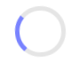
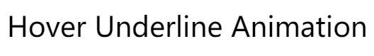

## 一、手写 Loading 动画

### （1）弹性加载动画

CSS 代码如下：

    .bounce-loading {
      width: 20rem;
      height: 10rem;
      background-color:aqua;
      display: flex;
      justify-content: center;
      align-items: center;
    }
    .bounce-loading > div {
      width: 1rem;
      height: 1rem;
      border-radius: 0.5rem;
      background-color:blueviolet;
      margin: 0 0.5rem;
      animation: bounce 1s infinite alternate;
    }
    @keyframes bounce {
      0% {
        transform: translateY(0);
        opacity: 1;
      }
      100% {
        transform: translateY(2rem);
        opacity: 0.1;
      }
    }
    .bounce-loading > div:nth-child(2) {
      animation-delay: 0.2s;
    }
    .bounce-loading > div:nth-child(3) {
      animation-delay: 0.4s;
    }

HTML 代码如下：

    

      

      

      

    

效果如下：

### （2）旋转小圆圈

CSS 代码如下：

    .donut-loading {
      width: 2rem;
      height: 2rem;
      border-radius: 2rem;
      border: 3px solid rgba(0, 0, 0, 0.1);
      border-left-color: #7983ff;
      animation: rotate 1s infinite linear;
    }
    @keyframes rotate {
      from {
        transform: rotate(0deg)
      }
      to {
        transform: rotate(360deg)
      }
    }

HTML 代码如下：

    

  
效果如下：

## 二、构建一个宽高比固定的 div

CSS 代码如下：

    .reactive-height {
      width: 50%;
      background-color: aqua;
    }
    .reactive-height::before {
      content: '';
      float: left;
      padding-top: 100%;
    }
    .reactive-height::after {
      content: "";
      clear: both;
      display: table;
    }
  
HTML 代码如下：

    

## 三、自定义滚动条

CSS 代码如下：

    .custom-scrollbar {
      width: 40rem;
      height: 7rem;
      background-color: aliceblue;
      overflow-y: scroll;
    }
    .custom-scrollbar::-webkit-scrollbar {
      width: 8px;
    }
    .custom-scrollbar::-webkit-scrollbar-thumb {
      border-radius: 10px;
      background-color:mediumpurple;
    }

HTML 代码如下：

    

      

        Pellentesque habitant morbi tristique senectus et 
        netus et malesuada fames ac turpis egestas. 
        Vestibulum tortor quam, feugiat vitae, 
        ultricies eget, tempor sit amet, ante. 
        Donec eu libero sit amet quam egestas semper. 
        Aenean ultricies mi vitae est. Mauris placerat 
        eleifend leo. Quisque sit amet est et sapien 
        ullamcorper pharetra. Vestibulum erat wisi, 
        condimentum sed, commodo vitae, ornare sit amet, 
        wisi. Aenean fermentum, elit eget tincidunt condimentum, 
        eros ipsum rutrum orci, sagittis tempus lacus enim ac dui. 
        Donec non enim in turpis pulvinar facilisis. Ut felis. 
        Praesent dapibus, neque id cursus faucibus, tortor neque 
        egestas augue, eu vulputate magna eros eu erat. Aliquam 
        erat volutpat. Nam dui mi, tincidunt quis, accumsan 
        porttitor, facilisis luctus, metus
      

    

  
效果截图如下：

  

## 四、自定义文本选择时的样式

CSS 代码如下：

    .custom-text-selection {
      width: 50%;
    }
    .custom-text-selection::selection {
      background-color:navy;
      color: white;
    }

HTML 代码如下：

    

      Pellentesque habitant morbi tristique senectus et 
      netus et malesuada fames ac turpis egestas. 
      Vestibulum tortor quam, feugiat vitae, 
      ultricies eget, tempor sit amet, ante. 
      Donec eu libero sit amet quam egestas semper. 
      Aenean ultricies mi vitae est. Mauris placerat 
      eleifend leo. Quisque sit amet est et sapien 
      ullamcorper pharetra. Vestibulum erat wisi, 
      condimentum sed, commodo vitae, ornare sit amet, 
      wisi. Aenean fermentum, elit eget tincidunt condimentum, 
      eros ipsum rutrum orci, sagittis tempus lacus enim ac dui. 
      Donec non enim in turpis pulvinar facilisis. Ut felis. 
      Praesent dapibus, neque id cursus faucibus, tortor neque 
      egestas augue, eu vulputate magna eros eu erat. Aliquam 
      erat volutpat. Nam dui mi, tincidunt quis, accumsan 
      porttitor, facilisis luctus, metus
    

效果截图如下：

## 五、禁止文本被选中

CSS 代码如下：

    .disable-selection {
      width: 50%;
      user-select: none;
    }

HTML 代码如下：

    

      Pellentesque habitant morbi tristique senectus et 
      netus et malesuada fames ac turpis egestas. 
      Vestibulum tortor quam, feugiat vitae, 
      ultricies eget, tempor sit amet, ante. 
      Donec eu libero sit amet quam egestas semper. 
      Aenean ultricies mi vitae est. Mauris placerat 
      eleifend leo. Quisque sit amet est et sapien 
      ullamcorper pharetra. Vestibulum erat wisi, 
      condimentum sed, commodo vitae, ornare sit amet, 
      wisi. Aenean fermentum, elit eget tincidunt condimentum, 
      eros ipsum rutrum orci, sagittis tempus lacus enim ac dui. 
      Donec non enim in turpis pulvinar facilisis. Ut felis. 
      Praesent dapibus, neque id cursus faucibus, tortor neque 
      egestas augue, eu vulputate magna eros eu erat. Aliquam 
      erat volutpat. Nam dui mi, tincidunt quis, accumsan 
      porttitor, facilisis luctus, metus
    

## 六、渐变色文本

HTML 代码如下：

    

      gradient-text
    

CSS 代码如下：

    .gradient-text {
      background: -webkit-linear-gradient(pink, red);
      -webkit-text-fill-color: transparent;
      -webkit-background-clip: text;
    }

效果截图如下：

## 七、Hover 下划线效果

该部分实现一个鼠标移入时的下划线变化效果，共用一段 HTML 代码，代码如下：

    

      Hover Underline Animation
    

各部分实现效果的 CSS 代码各异，将分别给出。

### （1）从中间开始变化

CSS 代码如下：

    .hover-underline-animation {
      cursor: pointer;
    }
    .hover-underline-animation::after {
      content: '';
      width: 100%;
      height: 2px;
      display: block;
      background-color: #7983ff;
      transform: scaleX(0);
      transition: transform 0.3s;
    }
    .hover-underline-animation:hover::after {
      transform: scaleX(1);
    }

效果截图如下：

  

### （2）从左至右变化

CSS 代码如下：

    .hover-underline-animation {
      cursor: pointer;
    }
    .hover-underline-animation::after {
      content: '';
      width: 100%;
      height: 2px;
      display: block;
      background-color: #7983ff;
      transform: scaleX(0);
      transform-origin: right;
      transition: transform 0.3s;
    }
    .hover-underline-animation:hover::after {
      transform: scaleX(1);
      transform-origin: left;
    }

效果截图如下：

### （3）实现左入左出、右入右出的效果

