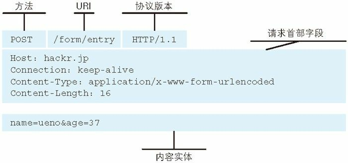

## 图解 HTTP 笔记（二）——简单的 HTTP 协议

> 本章主要以 HTTP 1.0 为例，讲解 HTTP 协议的基本结构。

在两台计算机之间使用 HTTP 协议进行通讯时，在一条通讯线路上必定有一端是客户端，另一端则是服务器端。

请求访问文本或图像等资源的一端成为客户端，而提供资源响应的一端成为服务器端。

HTTP 协议规定，请求从客户端发出，最后服务器端响应该请求并返回。

### 一、请求和响应报文的组成

某个客户端发出的请求如下：

```
GET /index.htm HTTP/1.1
Host: hackr.jp
```

其中，GET 表示请求访问服务器的类型，称为方法（method）。随后的字符串`/index.htm`表示 请求访问的资源对象，也叫作请求 URI。最后的 HTTP/1.1 表示所使用的 HTTP 版本号，用于提示客户端所使用的 HTTP 版本。

所以上面这段请求头表示使用 GET 方法请求 hackr.jp 服务器上的 index.htm 资源，客户端使用的 HTTP 版本是 1.1。

总结而言：**请求报文是由请求方法、请求 URI、协议版本、可选的请求首部字段和内容实体构成的**。



上图解释了请求报文的组成。

接收到请求的服务器，返回了如下内容：

```
HTTP/1.1 200 OK
Date: Tue, 10 Jul 2012 06:50:15 GMT
Content-Length: 362
Content-Type: text/html
<html>
......
```

其中，HTTP/1.1 表示服务器对应的 HTTP 版本；后面的 `200 OK` 表示请求的处理结果的状态码（status code）。下一行表示响应创建的时间，是响应首部字段（header field）的一个属性。空一行之后的内容表示资源主体的实体（entity body）。

总结：**响应报文基本上由协议版本、状态码（表示请求成功或者失败的数字代码）、用以解释状态码的原因短语、可选的响应首部字段以及实体主体构成**。


上图是响应报文的组成。

### 二、HTTP 是无状态协议

HTTP 是一种不保存状态，即无状态（stateless）的协议。HTTP 自身不对请求和响应之间的通信状态进行保存。每次有新的请求建立时，就会有对应的响应产生，与之前或者之后的请求都没有任何关系。

HTTP 的无状态特点，既有好处也有坏处。好处在于无状态的特点使得 HTTP 不用维护客户端状态，大大简化了协议内容和服务器的工作，确保了协议的可伸缩性。坏处在于随着 Web 的发展，网站应用越来越复杂，无状态的协议需要通过其他手段维持客户端状态（登录信息），比如 Cookie 技术，就是从 HTTP 1.1 开始引入的维持状态的手段。

### 三、告知服务器意图的 HTTP 方法

HTTP 1.1 主要包含了以下可以使用的方法。

* **GET** 方法用来请求访问已被 URI 识别的资源。指定的资源经过服务器解析后返回响应内容。
* **POST **方法用来传输实体的主体。虽然用 GET 方法也可以传输实体的主体，但是一般不用 GET 方法。**虽说 POST 方法的功能和 GET 相似，但是 POST 的主要目的并不是获取响应的主体内容**。
* **PUT** 方法主要用来传输文件，就像 FTP 的文件上传一样，要求在请求报文的主体中包含文件内容，然后保存到 URI 指定位置。由于 HTTP 1.1 的 PUT 方法不带验证机制，任何人都可以上传文件，所以具有安全隐患，一般不采用 PUT 方法。
* **DELETE** 方法主要用于删除服务器上的文件，与 PUT 相反，DELETE 方法删除 URI 指定的服务器文件。同样由于存在安全隐患，所以一般不采用 DELETE 方法。
* **HEAD** 方法主要用于确认 URI 的有效性及资源更新的日期时间等，不会返回报文的主体内容。
* **OPTIONS** 方法用来查询针对请求 URI 指定的资源所支持的方法。
* **TRACE** 方法用来追踪路径，发送请求时，在请求首部字段中加入 `Max-Forwards` 字段，值为数字，每经过一个服务器，该字段就会减一，当到达某个使该字段为 0 的服务器时，就会返回状态码为 200 OK 的响应。通过 TRACE 方法可以查询发送出去的请求是怎样被加工/篡改的。TRACE 方法本身使用场景较少，而且存在跨站追踪攻击的隐患，所以使用场景更加少了。
* **CONNECT** 方法表示要求用隧道协议连接代理。在与代理服务器通信时，实现用隧道协议进行 TCP 通信，主要使用 SSL（Secure Sockets Layer，安全套接层）和 TLS（Transport Layer Security，传输层安全）。

需要注意的是方法名区分大小写，记得要使用大写字母。

下表是 HTTP 1.0 和 HTTP 1.1 支持的一些方法。

| 方法    | 说明                   | 支持的 HTTP 协议版本 |
| :------ | ---------------------- | -------------------- |
| GET     | 获取资源               | 1.0/1.1              |
| POST    | 传输实体主体           | 1.0/1.1              |
| PUT     | 传输文件               | 1.0/1.1              |
| HEAD    | 获得报文首部           | 1.0/1.1              |
| DELETE  | 删除文件               | 1.0/1.1              |
| OPTIONS | 询问支持的方法         | 1.1                  |
| TRACE   | 追踪路径               | 1.1                  |
| CONNECT | 要求用隧道协议连接代理 | 1.1                  |
| LINK    | 建立和资源之间的联系   | 1.0                  |
| UNLINK  | 断开连接关系           | 1.0                  |

其中比较常用的包括：`GET`、`POST`、`OPTIONS` 方法。

### 四、持久连接

我们知道 HTTP 协议基于 TCP 协议，而 TCP 协议每次建立之前都会进行“三次握手”，所以如果每次发送 HTTP 请求都要建立 TCP 连接的话，会造成过多的“握手”浪费服务器资源。而 HTTP 协议的初始版本中，每次 HTTP 通信都需要重新建立 TCP 请求，这是一个很大的缺点。

为了解决上述问题，HTTP 1.1 引入了持久连接（HTTP Persistent Connections，也成为 HTTP keep-alive 或者 HTTP connection reuse）。持久连接的特点是只要任意一方没有提出断开 TCP 连接，就会一直维持 TCP 的连接状态。

持久连接的好处在于减少了 TCP 连接的重复建立和断开所造成的额外开销，减轻了服务器的负载。**在 HTTP 1.1 中，所有的连接默认都是持久连接**。

### 五、管线化

持久连接使得多数请求以管线化（pipeline）方式发送成为可能。以前发送请求后需要等待响应之后才能发送下一个请求，但是管线化技术出现后，不同等待响应就可以发起下一个请求，这样能够做到多个请求并行发送，大大减少了页面加载的时间。

### 六、使用 Cookie 管理状态

之前提到过 HTTP 是无状态协议，我们通过 Cookie 维持客户端状态。

Cookie 会根据从服务端发送的响应报文内的一个叫做 `Set-Cookie` 的首部字段信息，通知客户端保存 Cookie。当下次客户端再往该服务器发送请求时，客户端会自动在请求报文中加入 Cookie 值后发送出去。

服务器发现从客户端发送过来的 Cookie 之后，会去检查究竟是从哪一个客户端发来的连接请求，然后对比服务器上的记录，最后得到之前的状态信息。

设置 Cookie 的响应报文：

```
HTTP/1.1 200 OK
Date: Thu, 12 Jul 2012 07:12:20 GMT
Server: Apache
<Set-Cookie: sid=1342077140226724; path=/; expires=Wed,
10-Oct-12 07:12:20 GMT>
Content-Type: text/plain; charset=UTF-8
```

携带有 Cookie 信息的请求报文：

```
GET /image/ HTTP/1.1
Host: hackr.jp
Cookie: sid=1342077140226724
```

