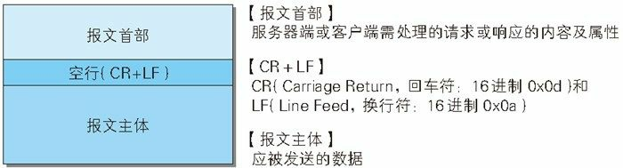
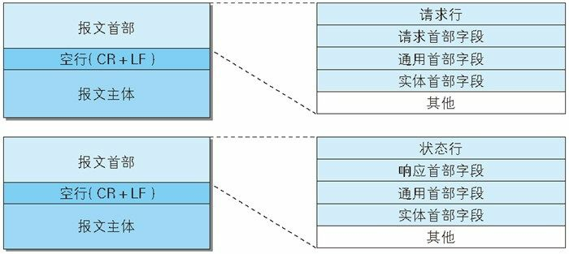

## 图解 HTTP 笔记（三）—— HTTP 报文内的 HTTP 信息

> 本章主要讲解请求和响应是如何运作的

### 一、HTTP 报文

**用于 HTTP 协议交互的信息被称为 HTTP 报文，客户端的 HTTP 报文叫做请求报文，服务器端的叫做响应报文**。

**HTTP 报文大致可分为报文首部和报文主体两块，两者通过空行划分（CR + LF），通常并不一定要有报文主体**

> CR：Carriage Return，回车符，16 进制的 0x0d
>
> LF：Line Feed，换行符，16 进制的 0x0a



下图展示了请求报文和响应报文的结构：



其中：

* **请求行** 包含用于请求的方法，请求 URL 和 HTTP 版本。
* **状态行** 包含表明响应结果的状态码，原因短语和 HTTP 版本。
* **首部字段** 包含表示请求和响应的各种条件和属性的各类首部。一般包括通用首部、请求首部、响应首部和实体首部。
* **其他** 包含一些未在 RFC 中定义的首部（Cookie 等）。

### 二、通过编码提升传输速率

HTTP 在传输时可以按照原始数据直接传输，也可以预先将数据进行压缩后再传输。编码压缩后可以减少传输的数据量，能够提升传输速率，但是会压缩过程会消耗更多的 CPU 资源。

#### 2.1 报文主体和实体主体的差异

* **报文（message）** 是 HTTP 通信过程中的基本单位，由八位组字节流组成，通过 HTTP 传输。
* **实体（entity）** 作为请求或者响应的有效载荷数据被传输，其内容由实体首部和实体主体构成。

HTTP 报文的主体用于传输实体的主体（请求或者响应的）。

**通常情况下，报文主体就是实体主体。但是在进行编码压缩时，实体主体部分会被编码，导致与报文主体不同**。

#### 2.2 压缩传输的内容编码

内容编码指明应用在实体内容上的编码格式，并保持实体信息原样压缩，压缩之后的内容在客户端被接受之后会进行解码还原。

常用的内容编码有一下几种：

* gzip（GNU zip）
* compress（UNIX 系统的标准压缩）
* deflate（zlib）
* identity（不进行编码）

现在还有一种新兴的优秀算法——Brotli，但是目前还没有被广泛采用。

#### 2.3 分块传输编码

在传送大容量数据时，通过把数据分割成多块，能够让浏览器逐步显示页面。这种功能成为**分块传输编码（Chunked Transfer Coding）**。

分块传输会将实体主体分割成多个块（chunk）来传输，每一块都用十六进制来标记块的大小，而实体主体的最后一块会使用“0（CR+LF）”来标记。

### 三、发送多种数据的多部分对象集合

邮件附件能够同时传送多种内容的数据，是因为采用了 MIME（Multipurpose Internet Mail Extensions，多用途因特网邮件扩展）机制，它允许邮件处理文本、图片、视频等多种类型的数据。相应的，HTTP 也采纳了部分多部分对象集合。

多部分对象集合包含的对象如下：

* **multipart/form-data**：在 Web 表单上传时使用。
* **multipart/byteranges**：状态码 206（Partial Content，部分内容）响应报文包含了多个范围的内容时使用。

我们通过指定 `Content-Type` 请求头来使用多部分对象结合。

### 四、获取部分内容的范围请求

指定范围发送的请求叫做**范围请求（Range Request）**。

对于一份 10000 字节大小的资源，可以通过范围请求一次只请求 5001 ～ 10000 字节的资源。

执行范围请求时，会通过 Range 首部字段来指定资源的 byte 范围，比如：

* 5000 - 10000 字节：

  ```
  Range: bytes=5001-10000
  ```

* 5000 字节之后的所有内容：

  ```
  Range: bytes=5000-
  ```

* 从一开始到 3000 字节和 5000 字节到 7000 字节的内容：

  ```
  Range: bytes=0-3000,5000-7000
  ```

针对范围请求，响应会返回状态码为 **206 Partial Content** 的响应报文。

对于多重范围的范围请求，响应会在首部字段 `Content-Type` 表明 `multipart/byteranges` 后返回。

### 五、内容协商返回最合适的内容

内容协商机制是指客户端和服务器端就响应的资源内容进行交涉，然后提供给客户端最为合适的资源。

内容协商会以语言、字符集、编码方式等为基准判断响应的资源。

包含在请求报文中的一些首部字段就是服务端响应的判断标准：

* **Accept**
* **Accept-Charset**
* **Accept-Encoding**
* **Accept-Language**
* **Content-Language**