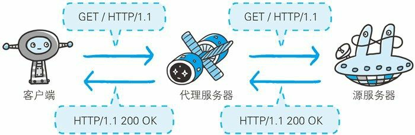
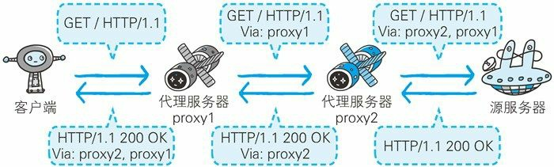
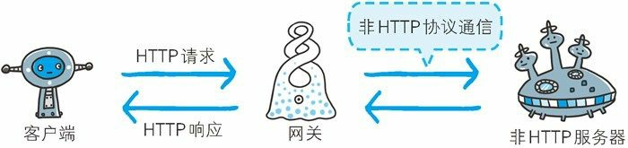
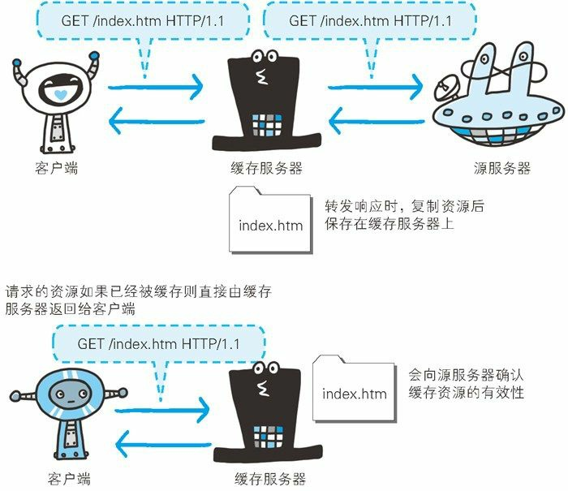

## 图解 HTTP 笔记（五）——Web 服务器

> 该章的主要内容是讲解与 HTTP 协作的 Web 服务器

### 一、用单台虚拟主机实现多个域名

基于虚拟主机的功能，可以只使用一台物理机实现多个域名的网站部署。

在互联网上，域名通过 DNS 域名解析系统可以映射到具体的 IP 上，多个域名可以映射到同一个 IP，但是一个域名只能映射到一个 IP。如果服务器想知道请求来自于哪个域名，可以通过请求头中的 Host 首部字段获取。

### 二、代理、网关和隧道

HTTP 通信时，除服务端和客户端以外，还有一些用于通信数据转发处理的**应用程序**，例如代理、网关和隧道，它们可以配合服务器工作。

* **代理**是一种有转发功能的应用程序，扮演者服务器和客户端的中间人的角色。代理接受客户端的请求转发给服务器，然后接受服务器的响应转发给客户端。
* **网关**是转发其他服务器通信数据的服务器，接收从客户端发送来的请求时，它就像自己拥有资源的源服务器一样对请求进行处理。
* **隧道**是在相隔甚远的客户端和服务器之间进行中转并保持双方连接的应用程序。

#### 2.1 代理

代理服务器的基本行为就是在客户端和服务端之间转发请求和响应，代理不改变请求 URI，会直接发送给持有资源的服务器（称为**源服务器**）。

每次通过代理转发请求或者响应时，会追加写入 Via 首部字段，该字段会标记处经过的代理主机信息。

使用代理服务器的理由包括利用缓存技术减少网络带宽的流量，组织内部针对特定网站的访问控制，获取访问日志等。

代理的使用方式可以按照是否使用缓存和是否修改报文来进行分类。

**缓存代理**：代理转发响应时，会把资源保存在代理服务器上，当代理再接收到相同的资源请求时，会返回之前缓存的资源。

**透明代理**：转发请求或者响应时，不对报文进行任何修改的代理类型称为透明代理，反之称为非透明代理。

#### 2.2 网关

网关的工作机制和代理十分相似，但是网关可以使通信线路上的服务器提供非 HTTP 协议服务。

利用网关能提高通信的安全性，因为可以在客户端和网关之间的通信线路上加密以确保连接的安全性。

#### 2.4 隧道

隧道可以按照要求建立起一条与其他服务器的通信线路，届时使用 SSL 等加密手段进行通信。**隧道的目的是确保客户端与服务端能够进行安全的通信**。

### 三、保存资源的缓存

缓存是指代理服务器或客户端本地磁盘内保存的资源副本。

利用缓存可以减少对源服务器的访问，可以减少通信流量和通信时间。

缓存服务器是代理服务器的一种，并归类在缓存代理类型中。

#### 3.1 缓存的有效期限

即使存在缓存，也会因为客户端的要求、缓存的有效期等因素向源服务器确认资源的有效性。若缓存失效，缓存服务器会再次向源服务器获取“新的”资源。

#### 3.2 客户端缓存

除了代理服务器内的缓存以外，客户端的浏览器也可以缓存。同样的客户端也会向源服务器确定资源的有效性，然后再返回有效的资源。

