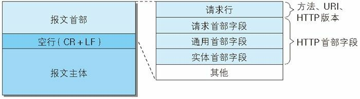

## 图解 HTTP 笔记（六）——HTTP 首部

> 本章主要讲解了 HTTP 首部的结构，已经首部中各字段的用法。

### 一、HTTP 报文首部



上图是 HTTP 请求报文的结构。

HTTP 请求报文由方法、URI、HTTP 版本、HTTP 首部字段等组成。

请求报文首部信息实例：

```
GET / HTTP/1.1
Host: hackr.jp
User-Agent: Mozilla/5.0 (Windows NT 6.1; WOW64; rv:13.0) Gecko/2010010
Accept: text/html,application/xhtml+xml,application/xml;q=0.9,*/*; q=0
Accept-Language: ja,en-us;q=0.7,en;q=0.3
Accept-Encoding: gzip, deflate
DNT: 1
Connection: keep-alive
If-Modified-Since: Fri, 31 Aug 2007 02:02:20 GMT
If-None-Match: "45bae1-16a-46d776ac"
Cache-Control: max-age=0
```

HTTP 响应报文由 HTTP 版本、状态码（数字和原因短语）、HTTP 首部字段三部分组成。

下图是 HTTP 响应报文结构：


响应报文的首部实例：

```
HTTP/1.1 304 Not Modified
Date: Thu, 07 Jun 2012 07:21:36 GMT
Server: Apache
Connection: close
Etag: "45bae1-16a-46d776ac"
```

### 二、HTTP 首部字段

#### 2.1 HTTP 首部字段结构

HTTP 首部字段传递重要信息，其结构基本如下：

```
首部字段名：字段值
```

例如：

```
Content-Type：text/html
```

另外，有些首部字段可以有多个值，如下所示：

```
Keep-Alive：timeout=15，max=100
```

#### 2.2 HTTP 首部字段类型

HTTP 首部字段根据实际用途被分为四种类型。

* `通用首部字段`：请求报文和响应报文都会使用到的首部字段。
* `请求首部字段`：从客户端向服务端发送请求报文时使用的首部。补充了请求的附加内容、客户端信息、响应内容相关优先级的信息。
* `响应首部字段`：从服务端向客户端发送响应报文时的首部。补充了响应的附加内容，也会要求客户端附加的内容信息。
* `实体首部字段`：针对请求报文和响应报文的实体部分使用的首部。补充了资源内容更新时间等与实体内容相关的信息。

#### 2.3 HTTP 首部字段一览

##### 2.3.1 通用首部字段

| 首部字段名        | 说明                       |
| ----------------- | -------------------------- |
| Cache-Control     | 控制缓存的行为             |
| Connection        | 逐跳首部、连接的管理       |
| Date              | 创建报文的日期时间         |
| Pragma            | 报文指令                   |
| Trailer           | 报文末尾的首部一览         |
| Transfer-Encoding | 指定报文主体的传输编码方式 |
| Upgrade           | 升级为其他协议             |
| Via               | 代理服务器的相关信息       |
| Warning           | 错误通知                   |

##### 2.3.2 请求首部字段

| 首部字段名          | 说明                                            |
| ------------------- | ----------------------------------------------- |
| Accept              | 用户代理可处理的媒体类型                        |
| Accept-Charset      | 优先的字符集                                    |
| Accept-Encoding     | 优先的内容编码                                  |
| Accept-Language     | 优先的语言（自然语言）                          |
| Authorization       | Web 信息认证                                    |
| Expect              | 期待服务器的特定行为                            |
| From                | 用户的电子邮箱地址                              |
| Host                | 请求资源所在的服务器                            |
| If-Match            | 比较实体标记（ETag）                            |
| If-Modified-Since   | 比较资源的更新时间                              |
| If-None-Match       | 比较实体标记（与 If-Match 相反）                |
| If-Range            | 资源未更新时发送实体 Byte 的范围请求            |
| If-Unmodified-Since | 比较资源的更新时间（与 If-Modified-Since 相反） |
| Max-Forwards        | 最大传输逐跳数                                  |
| Proxy-Authorization | 代理服务器要求客户端的认证信息                  |
| Range               | 实体的字节范围请求                              |
| Referer             | 对请求中 URI 的原始获取方                       |
| TE                  | 传输编码的优先级                                |
| User-Agent          | HTTP 客户端程序的信息                           |

##### 2.3.3 响应首部字段 

| 首部字段名         | 说明                         |
| ------------------ | ---------------------------- |
| Accept-Ranges      | 是否接受字节范围请求         |
| Age                | 推算资源创建经过时间         |
| ETag               | 资源的匹配信息               |
| Location           | 令客户端重定向至指定 URI     |
| Proxy-Authenticate | 代理服务器对客户端的认证信息 |
| Retry-After        | 对再次发起请求的时机要求     |
| Server             | HTTP 服务器的安装信息        |
| Vary               | 代理服务器缓存的管理信息     |
| WWW-Authenticate   | 服务器对客户端的认证信息     |

##### 2.3.4 实体首部字段

| 首部字段名       | 说明                   |
| ---------------- | ---------------------- |
| Allow            | 资源可支持的 HTTP 方法 |
| Content-Encoding | 实体主体适用的编码方式 |
| Content-Language | 实体主体的自然语言     |
| Content-Length   | 实体主体的大小（字节） |
| Content-Location | 替代对应资源的 URI     |
| Content-MD5      | 实体主体的报文摘要     |
| Content-Range    | 实体主体的位置范围     |
| Content-Type     | 实体主体的媒体类型     |
| Expires          | 实体主体过期的日期时间 |
| Last-Modified    | 资源的最后修改时间     |

以上就是最常用的一些 HTTP 首部字段。

其他还有一些非 HTTP/1.1 规范的首部字段也用的比较多，比如 Set-Cookie、Cookie 等等。

此外，HTTP 首部根据将定义成缓存代理和非缓存代理的行为，分成了两种类型——端到端首部（End-to-End Header）和逐跳首部（Hop-by-Hop Header）。

端到端首部类的首部字段会转发给请求/响应的最终接受对象，且必须保存在由缓存生成的响应中，另外规定它必须转发；

逐跳首部只对单次转发有效，会因通过缓存或代理而不再转发。HTTP/1.1 之后的版本中使用逐跳首部需要提供 Connection 首部字段。

下面这些字段都属于逐跳首部字段：

* Connection
* Keep-Alive
* Proxy-Authenticate
* Proxy-Authorization
* Trailer
* TE
* Transfer-Encoding
* Upgrade

所有其余字段皆为端到端首部字段。

下面开始详细介绍各个首部字段。

#### 2.4 HTTP/1.1 通用首部字段

##### 2.4.1 Cache-Control

通过指定首部字段 Cache-Control，就能操作缓存的工作机制。

Cache-Control 的指令参数是可选的，多个指令之间通过逗号分开。该首部字段在请求和响应时都可以使用。

```
Cache-Control: private, max-age=0, no-cache
```

**Cache-Control 可用指令如下：**

请求指令：

| 指令             | 参数   | 说明                             |
| ---------------- | ------ | -------------------------------- |
| no-cache         | 无     | 强制向源服务器再次验证           |
| no-store         | 无     | 不缓存请求或响应的任何内容       |
| max-age=[秒]     | 必需   | 响应的最大 age 值                |
| max-stale(=[秒]) | 可省略 | 接受已过期的响应                 |
| min-fresh=[秒]   | 必需   | 期望在指定的时间内的响应仍然有效 |
| no-transform     | 无     | 代理不可更改媒体类型             |
| only-if-cached   | 无     | 从缓存获得资源                   |
| cache-extension  | -      | 新指令标记（token）              |

响应指令：

| 指令             | 参数   | 说明                                           |
| ---------------- | ------ | ---------------------------------------------- |
| public           | 无     | 可向任意方提供响应的缓存                       |
| private          | 可省略 | 仅向特定用户返回响应                           |
| no-cache         | 可省略 | 缓存前必须确认其有效性                         |
| no-store         | 无     | 不缓存请求或响应的任何内容                     |
| no-transform     | 无     | 代理不可更改媒体类型                           |
| must-revalidate  | 无     | 可缓存但必须再向源服务器进行确认               |
| proxy-revalidate | 无     | 要求中间缓存服务器对缓存的响应有效性再进行确认 |
| max-age=[秒]     | 必需   | 响应的最大 age 值                              |
| s-maxage=[秒]    | 必需   | 公共缓存服务器响应的最大 age 值                |
| cache-extension  | -      | 新指令标记（token）                            |

****

规定是否缓存的指令：

**public 指令**

```
Cache-Control: public
```

当指定使用 public 指令时，则明确表明其他用户也可利用缓存。

**private 指令**

```
Cache-Control: private
```

当指定 private 指令后响应只以特定的用户作为对象，当该对象向服务器发起请求时，服务器会返回缓存的资源。

**no-cache 指令**

```
Cache-Control: no-cache
```

该指令的目的是为了防止使用过期的缓存资源。

**如果客户端发送的请求中包含 no-cache 指令**，则表示客户端将不会接受过期的缓存过的响应。于是，中间的代理服务器必须把请求转发给源服务器。

**如果服务器返回的响应中包含 no-cache 指令**，那么缓存服务器不能对资源进行缓存，源服务器以后也将不再对缓存服务器请求中提出的资源有效性进行确认，且禁止其对资源响应进行缓存操作。

****

控制可执行缓存对象的指令：

**no-store 指令**

```
Cache-Control: no-store
```

当使用 no-store 指令时，暗示请求或响应中包含机密信息。

因此该指令规定缓存不能在本地存储请求或响应的任一部分。

**注意**

> 从字面意义来说，很容易把 no-cache 理解为不缓存，但事实上 no-cache 代表的是不缓存过期的资源，缓存会向源服务器确认有效性后再处理资源。no-store 才是真正的不进行缓存。

****

指定缓存期限和认证的指令：

**s-maxage 指令**

```
Cache-Control: smax-age=604800（单位：秒）
```

该指令功能和 max-age 相同，不同点是 s-maxage 指令只适合于供多位用户使用的公共缓存服务器。

当使用 smax-age 指令之后，直接会忽略 Expires 字段及 max-age 指令的处理。

**max-age 指令**

```
Cache-Control: max-age=604800（单位：秒）
```

**当客户端发送的请求中包含 max-age 指令时**，如果判定缓存资源的缓存时间数值比指定的数值更小，那么客户端就接收缓存的资源。另外，当指定 max-age 值为 0，那么缓存服务器通常需要将请求转发给源服务器（相当于是 no-cache）。

**当服务器返回的响应中包含 max-age 指令时**，缓存服务器将不对资源的有效性再做确认，而 max-age 数值代表的是资源保存为缓存的最长时间。

**应用 HTTP/1.1 版本的缓存的服务器遇到同时存在 Expires 首部字段的情况时，会优先处理 max-age 指令，而忽略掉 Expires 首部字段。而应用 HTTP/1.0 版本的服务器则恰恰相反**。

**min-fresh 指令**

```
Cache-Control: min-fresh=60（单位：秒）
```

min-fresh 指令要求缓存服务器返回至少还未过指定时间的缓存资源（即指定时间过后仍然是未过期的资源）。

**max-stale 指令**

```
Cache-Control: max-stale=3600（单位：秒）
```

使用 max-stale 表示接受过期的缓存资源，后面的值表示具体过期的时长，表示响应不能已经过时超过该给定的时间。如果不传递数值，则表示无论经过多久，客户端都能够接受。

**only-if-cached 指令**

```
Cache-Control: only-if-cached
```

使用该指令表示客户端仅在缓存服务器本地缓存目标资源的情况下才会要求其返回。即只接受已缓存的资源，并且不用向源服务器检查资源的有效性。若代理服务器本地缓存无响应，则返回 504 Gateway Timeout。

**must-revalidate 指令**

```
Cache-Control: must-revalidate
```

使用该指令，代理会向源服务器再次验证即将返回的响应缓存目前是否仍然有效。

使用 must-revalidate 指令会忽略 max-stale 指令。

