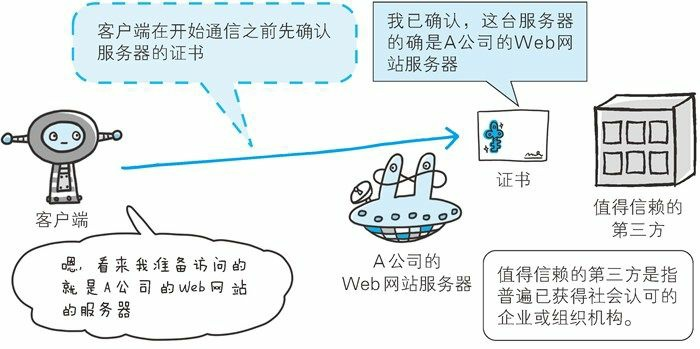
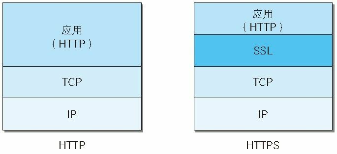
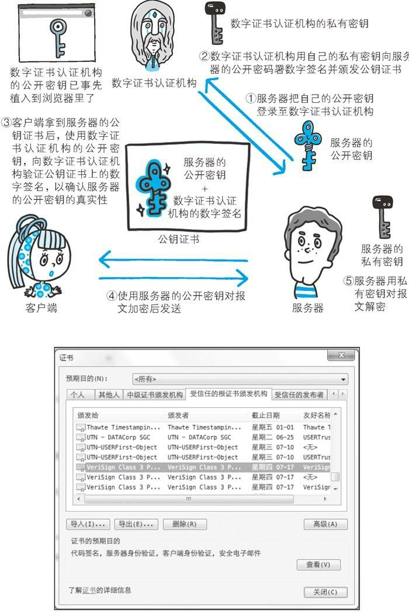
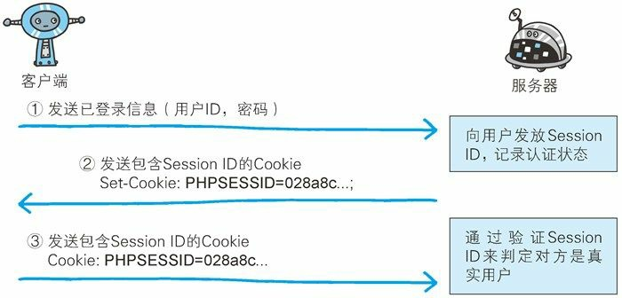

## 图解 HTTP 笔记（七）——HTTPS

> 本章主要讲解 HTTPS 的基本原理，以及如何利用 HTTPS 防范 HTTP 通信过程中存在的伪装、窃听、篡改等问题

### 一、HTTP 的缺点

HTTP 在通信过程中会面临以下三种安全问题：

* 通信使用明文（不加密），内容可能会被窃听。
* 不验证通信方的身份，可能会遭遇伪装。
* 无法验证报文的完整性，可能已经被篡改。

#### 1.1 窃听

HTTP 本身不具备加密功能，所以传输过程中都是以明文方式发送。

由于在网络的传输过程中，我们所发送的信息要经过许多的网络节点和设备，在这个过程中这些设备是可能会拦截我们的信息并且进行窃听的，直接通过一些常用的抓包工具就可以窃听未加密的网络传输信息。

**通过加密防止窃听**

（一）**通信的加密**：为了防止传输内容被窃听，我们采取的方式之一就是通信加密，HTTP 本身没有加密机制，但是我们可以通过将 HTTP 和 SSL（Secure Socket Layer 安全套接层）或者 TLS（Transport Layer Security 安全传输协议）组合使用来加密 HTTP 传输内容。

用 SSL 建立安全通信线路以后，就可以在这条线路上进行 HTTP 通信了。与 SSL 组合使用的 HTTP 被称为 HTTPS（HTTP Secure）。

（二）**内容的加密**：还有一种方式就是将参与通信的内容本身进行加密。这样的话就需要客户端对 HTTP 报文加密后再进行请求发送。由于该方式不同于 HTTPS 将整个通信线路加密的方式，所以内容仍然会有被篡改的风险。

#### 1.2 伪装

HTTP 协议本身并不会对通信的另一方进行身份验证，所以任何人都能对服务器发起请求。

不验证通信方可能就会存在各种安全隐患：

* 客户端无法确认自己的请求是否发送到了目标服务器或者返回响应的服务器是否是目标服务器，有可能是伪装了的服务器。
* 服务器无法确认向自己发起请求的客户端以及自己返回响应的客户端是否是目标中的客户端。
* 无法确认通信方是否具备访问权限，因为某些服务器只想给特定的用户访问。
* 即使是无意义的请求也会照单全收，使得服务器可能遭受到 DDoS 攻击。

**通过查明对方证书来防止伪装**

SSL 不仅提供加密处理，而且使用了一种称为证书的手段，可用于确认对方身份。

**证书由第三方机构颁发，用以证明服务器和客户端是实际存在的**。



通过使用证书可以证明通信方就是意料中的服务器。对使用者而言，也减少了个人信息泄露的风险。

另外，客户端持有证书即可完成个人身份的认证，也可用于对网站的认证环节。

#### 1.3 篡改

HTTP 协议通常无法确认信息的完整性，一旦传输的信息被篡改，那么信息就失去了准确性，导致信息有误。比如你想在某个网站下载一个资源，而你的网络传输已经被别人所劫持，在你发起下载请求的时候，你所接收到的资源正在被人修改，所以你下载到的资源就不是你想要的那个了。

像这样，请求或者响应在传输途中遭攻击者拦截并篡改内容的攻击称为中间人攻击（Man-in-the-Middle attack, MITM）。

**如何防止篡改**

之前的章节有提到过 Content-MD5 实体首部字段可用于确认实体内容是否完整，但是由于 Content-MD5 本身的值也可能被篡改，所以这个字段并不可靠，所以需要其他方法来确保传输的内容不被篡改。

通过其他散列算法来计算传输内容是否完整也不可靠，那么我们最终还是需要 HTTPS 来帮我们解决这个问题。SSL 提供认证和加密处理以及**摘要功能**。

### 二、HTTPS

```
HTTPS = HTTP + 加密 + 认证 + 摘要
```

#### 2.1 HTTPS 是身披 SSL 外壳的 HTTP

HTTPS 并非是应用层的一种新协议。只是 HTTP 通信接口部分用 SSL 和 TLS 协议代替而已。

通常，HTTP 直接和 TCP 通信。当使用 SSL 的时候，就先和 SSL 通信，再由 SSL 和 TCP 通信了。所以简而言之，HTTPS 就是身披 SSL 外壳的 HTTP 协议。



在采用 SSL 以后，HTTP 就拥有了 HTTPS 的加密、证书和完整性保护功能了。

> SSL 协议是独立于 HTTP 的协议，所以其他协议也可以采用 SSL 协议，它是当今世界上应用最广泛的网络安全技术

#### 2.2 相互交换密钥的公开密钥加密技术

在讲 SSL 之前可以先了解一下加密方法，SSL 采用一种叫做公开密钥加密（Public-key Cryptography）的加密处理技术。

近代的加密方法中，加密算法是公开的，但是密钥是保密的。加密和解密都会用到密钥。没有密钥就无法对密钥进行解密。反过来说，任何人只要拿到了密钥就可以解密信息。如果密钥被攻击者获得，那加密也就失去了意义。

##### 2.2.1 共享密钥加密的困境

**加密和解密使用同一个密钥的方式称为共享密钥加密（Common key crypto system），也被叫做对称密钥加密**。

采用共享密钥加密方式加密时，需要将密钥一起发送给通信方，所以有需要考虑密钥传输的安全性，需要设法安全地保管密钥，这便是共享密钥加密方式的困扰。

##### 2.2.2 使用两把密钥加密的公开密钥加密方式

公开密钥加密方式很好的解决了共享密钥加密方式的困扰。

公开密钥加密使用一对非对称的密钥。一把叫做私有密钥（private key），另一把叫做公开密钥（public key）。顾名思义，私有密钥不能被其他任何人知道，而公开密钥则可以仁任意传播，任何人都可以拿到。

使用公开密钥加密方式（非对称加密），发送密文的一方使用公钥进行加密处理，而接收方拿到被加密后的信息之后再使用自己的私钥进行解密。利用这种方式进行传输，就不需要发送密钥，也就不用担心密钥被攻击者拿走了。

##### 2.2.3 HTTPS 采用混合加密机制

**HTTPS 采用共享密钥加密方式和公开密钥加密方式混用的加密方式**。

如果密钥可以被安全传输，则 HTTPS 会考虑采用共享密钥加密方式，否则将采用公开密钥加密方式。这是因为公开密钥加密方式的速度比共享密钥加密方式要慢。HTTPS 充分地利用了两者的优点，将多种方法组合起来用于通信。**在使用公开密钥加密方式交换密钥之后，之后的信息传输使用共享密钥加密方式**。

#### 2.3 证明公开密钥正确性的证书

遗憾的是公开密钥加密方式本身也是有缺陷的，那就是无法证明公开的密钥本身是货真价实的。

为了解决上面说到的问题，可以使用由数字证书认证机构（CA，Certificate Authority）和其相关机构颁发的公开密钥证书。

数字证书认证机构处于客户端与服务端双方都信赖的第三方机构的立场上，威瑞新（VeriSign）就是其中一家非常有名的数字证书认证机构。

下面讲解一下数字证书认证机构的业务流程：

首先，服务器的运营人员会向数字机构提出公开密钥申请，CA 在认证申请者的身份信息之后，会对已申请的公开密钥进行数字签名，然后分配这个已签名的公开密钥，并将该公开密钥放入公钥证书之后绑定在一起。

服务器会将这份 CA 颁发的公钥证书发送给客户端，以进行公钥加密方式通信，公钥证书也可叫做数字证书或者直接称为证书。

接到证书的客户端可使用 CA 的公钥对证书的数字签名进行认证，一旦验证通过，客户端便可确认两件事：

* 认证服务器公钥的机构是真实有效的 CA 机构
* 服务器的公钥是值得信任的

于是这就达到了确认公钥真实有效性的目的。

安全地转交 CA 机构的密钥给客户端是一件困难的事，因此多数浏览器会在内部植入常用认证机构的公钥。



##### 2.3.1 可证明组织真实性的 EV SSL 证书

证书的一个作用是证明作为通信一方的服务器是否符合规范，另一个作用是确认服务器运营商企业是否真实存在。能够证明企业真实性的正式就是 EV SSL 证书（Extended Validation SSL Certificate）。

该证书的目的是为了防止钓鱼攻击（Phishing）。

##### 2.3.2 用以确认客户端的客户端证书

HTTPS 中还可以使用客户端证书对客户端进行认证。

### 三、Session 管理及 Cookie 应用

第八章要讲的内容不多，所以把最重要的一点挪到了这一篇笔记。

关于用户身份的认证，现在多数是采用表单认证，一般会采用 Cookie 来管理 Session（会话）。

大致流程如下：



具体步骤如下：

* 客户端把用户的 ID 密码等登录信息放入报文的实体部分，通常用 POST 方法发送至服务器端。
* 服务器生成并发放用来识别客户的 Session ID，这个 Session ID 同时会在服务器端保存，然后通过 Set-Cookie 字段绑定到客户端。顺便可以使用 `httponly` 属性来禁止 JavaScript 修改 Cookie，防止跨站脚本攻击。
* 客户端把 Session ID 保存在本地 Cookie，下次访问时再带上。服务器端通过验证接收到的 Session ID 来识别用户，从数据库中可以顺便取到与用户相关的一系列信息。