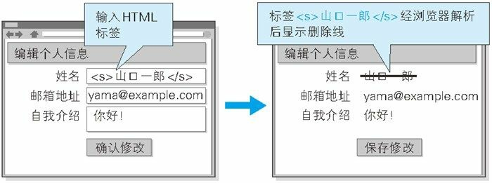

## 图解 HTTP 笔记（八）——常见 Web 攻击技术

> 本章主要讲解 HTTP 通信过程中的一些常见 Web 攻击技术

### 一、跨站脚本攻击

跨站脚本攻击（Cross-Site Scripting， XSS）是指通过存在安全漏洞的 Web 网站注册用户的浏览器内运行非法的 HTML 标签或者 JavaScript 代码的一种攻击方式。动态创建的 HTML 可能存在安全漏洞。

该攻击可能造成以下影响：

* 利用虚假输入表单骗取用户个人信息
* 利用脚本窃取用户的 Cookie 值，被害者在不知情的情况下，帮助攻击者发送恶意请求
* 显示伪造的文章或者图片

上图的表单输入以后直接把输入内容当做 HTML 展示在页面上，所以存在着安全漏洞，攻击者可以直接在输入框内编辑危险的代码，然后就会在页面上运行。

### 二、SQL 注入攻击

SQL 注入（SQL Injection）是指针对 Web 应用使用的数据库，通过运行非法的 SQL 而产生的攻击。该安全隐患有可能引发极大的安全威胁，有时会直接导致个人信息及机密信息的泄露。

SQL 注入可能会导致如下影响：

* 非法查看或篡改数据库内的数据
* 规避认证
* 执行和数据库服务器业务关联的程序等

如果我们不对输入进行验证就直接拿去拼接 SQL 的话，是可能会被执行 SQL 注入攻击的。

### 三、目录遍历攻击

目录遍历（Directory Traversal）攻击是指对本无意公开的文件目录，通过非法截断其目录路径后，达成访问目的的一种攻击。这种攻击有时也被叫做路径遍历攻击（Path  Traversal）。

### 四、会话劫持

会话劫持（Session Hijack）是指攻击者通过某种手段拿到了用户的会话 ID，并非法使用此会话 ID 伪装成用户，达到攻击的目的。

具备认证功能的 Web 应用，使用会话 ID 的会话管理机制，作为管理认证状态的主流方式。会话 ID 中记录客户端的 Cookie 等信息，服务器端将会话 ID 与认证状态进行一对一匹配管理。

攻击者可能通过以下方式获得会话 ID：

* 通过非正规的生成方法推测会话 ID
* 通过窃听或 XSS 攻击盗取会话 ID
* 通过会话固定攻击（Session Fixation）强行获取会话 ID

通常情况下攻击者在发现网站存在的 XSS 攻击漏洞之后，会注入一段 JavaScript 代码，通过 `document.cookie` 盗取到会话 ID，之后植入到自己的浏览器，就可以伪装成被盗窃的用户访问被攻击的网站。

### 五、跨站点请求伪造

跨站点请求伪造（Cross-Site Request Forgeries，CSRF）攻击是指攻击者通过设置好的陷阱，强制对已完成认证的用户进行非预期的个人信息或设定信息等某些状态更新，属于被动攻击。

最常见的例子就是在一个需要登录才能进行操作的网站，攻击者在该网站伪造了一个可以触发危险操作的内容（比如 a 和 button 标签），用户在不经意间点击这些伪造的内容后就自动发起了请求，而这些请求如果是指向当前网站的话，用户的会话 ID 等信息也会被带上，使得被攻击者不经意之间完成了一次可能极为危险的操作。

### 六、点击劫持

点击劫持（Clickjacking）是指利用透明的按钮或链接做成陷阱，覆盖在 Web 页面之上。然后诱导用户在不知情的情况下点击那个链接访问内容的一种攻击手段。这种行为又称为界面伪装（UI Redressing）。

这种攻击最常见的案例就是某些小网站……

### 七、DoS 攻击

DoS 攻击（Denial of Service Attack）是一种让运行中的服务呈停止状态的攻击。有时也叫作停止服务攻击或者拒绝服务攻击。DoS 攻击的对象不仅限于 Web 网站，还包括网络设备及服务器等。

DoS 主要有以下两种攻击方式：

* 集中利用访问请求造成资源过载，资源用尽的同时，实际上服务也就呈停止状态
* 通过攻击安全漏洞是服务停止

由此可见所有使得服务停止的攻击都可以称为 DoS 攻击。

DoS 攻击在中国前端届比较著名的案例就是阮一峰老师的博客遭到过的一次攻击：[DDOS 攻击的防范教程](<http://www.ruanyifeng.com/blog/2018/06/ddos.html>)。